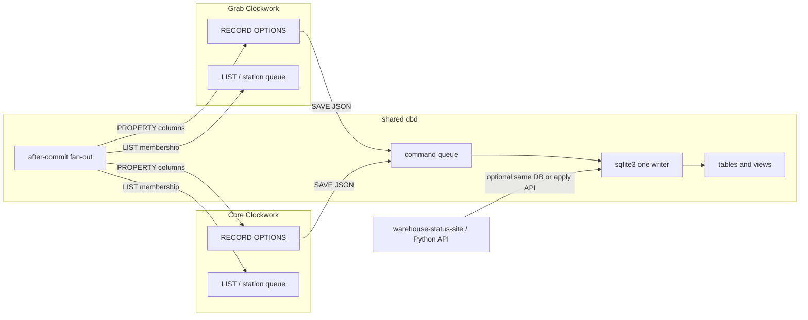

# Clockwork RECORD and native database

**Status:** Draft  
**Date:** 2026-08-23  
**Author:** (design)  
**Repos:** `latproc` (Clockwork/iod), `WarehouseSIM/JemalongDB` (Clockwork DATABASE_CHANNEL client), `Warehouse` (HTTP client to SamplingLine APIs), `SamplingLineProjects` (Python + Alembic data services)

This is the design spec only. Language, `dbd`, Warehouse LPC, SamplingLine, and `cw-migrate` implementation happen later on a separate branch.

---

## Overview

Clockwork already has a working sketch of database access, built under limited time: JSON action messages on `DATABASE_CHANNEL`, a `dbd` daemon, and MACHINEs whose OPTIONS look like a row. JemalongDB used that path for weight notes and bale details. Warehouse, needing a live plant data path before the Clockwork side was finished, talks HTTP (`WEBREQUEST`) to WoolSamplingLineAPI and copies JSON into `BALEDETAILAPI` OPTIONS, with `ChangeCounter` so panels know when to refresh.

Those pieces show the intended model clearly: a row should look like a MACHINE, and LIST/HMI should work with it. What remains is to finish the runtime so that OPTIONS *are* the row, so a commit can **push column values onto every Clockwork that holds that RECORD**, and so schema (including views) is versioned like Alembic.

The next step is a first-class **`RECORD` machine type** plus a **shared `dbd` SQL service**:

- RECORD looks like a MACHINE (WHEN, COMMAND, RECEIVE, OPTIONS); OPTIONS are columns of a table **or a view**.
- `dbd` is the one writer. It runs SQLite SQL (joins, views, filters) and is the bus **two plant Clockworks already need**: Grab and Core both talk to WoolSamplingLineAPI today; when one updates a bale, the other should see the RECORD OPTIONS change with no HTTP GET.
- Clockwork queries are JSON (same spirit as Jemalong `find` payloads), compiled in dbd to parameterized SQL — not a SQL string inside WHEN.
- LIST operations work because RECORD instances are real `MachineInstance`s. JemalongDB is the template we fold into that type.

---

## Background and motivation

### What exists in Clockwork today

| Piece | Location | What it actually does |
| --- | --- | --- |
| Language sketch | `tests/datastore.cw`, `tests/db-channel.cw` | Customer MACHINE with JSON action templates; `SEND request TO DATABASE_CHANNEL`; LOOKUP and result mapping still marked as future work |
| Jemalong client | `/Users/mike/src/latproc/WarehouseSIM/JemalongDB/` | Weight note + bale details as MACHINEs + INTERFACE helpers + `jemalong.conf` / `jemalong.db` |
| Channel | `database_channel.lpc`, `db-channel.cw` | `DATABASE_CHANNEL` PUBLISHER; `IGNORES STATE_CHANGES, PROPERTY_CHANGES` — only `SEND` JSON moves |
| Daemon | `iod/src/dbd.cpp` | Subscribes as `DATABASE_CHANNEL`, forwards payload to `tcp://127.0.0.1:5554`, then `PROPERTY` a JSON blob and `SEND <prop>_changed` |
| Persistence (unrelated) | `PersistentStore`, `persistd` | Key/value dump of properties to `persist.dat`. Not a database. |

`dbd` `send_response_to_clockwork` (dbd.cpp) parses `respond_to` as `machine.property`, sets that property to the JSON response, then sends `response_changed`. That was enough to prove the channel path. RECORD continues from there by applying the same notify path **per column** onto the row MACHINE, so OPTIONS stay in sync. The helper on port 5554 was an external database process; SQLite inside `dbd` is the intended completion of that role.

### JemalongDB: what the current features look like in use

Files:

- `WeightNote.lpc` — `WEIGHTNOTE MACHINE` with row OPTIONS (`wn`, `bales`, `cores`, `grabs`) **and** JSON templates (`create`/`insert`/`find_by_wn`/`find_all`/`update`/`delete`).
- `BaleDetails.lpc` — same pattern for catalog-ish columns (`baleId`, `eBaleId`, `weight`, …).
- `database.lpc` — one instance plus one INTERFACE per type; `NULL CONSTANT ""` as a stand-in while native NULL support was still landing.
- `database_channel.lpc` — publisher on port 10708, `MONITORS \`.*\``, ignores property/state changes.
- `jemalong.conf` — `db_name jemalong.db`.

This is a solid use of the features that existed: the row MACHINE holds fields, the INTERFACE builds the JSON the channel expects, and `respond_to` is how results come back.

1. HMI or program writes OPTIONS on the row MACHINE.
2. INTERFACE copies OPTIONS into `request` JSON (`ITEM ${data.wn} OF request := weight_note.wn`).
3. `SEND request TO DATABASE_CHANNEL`.
4. `dbd` plus the database process reply via `respond_to`.
5. INTERFACE receives `response` / `response_changed` and stores JSON in `data`.

What we still want from the runtime, which this layer could not provide yet:

- Apply the result onto the **same OPTIONS** that were sent, so a second read is unnecessary.
- `find_all` as a LIST of row machines, not a JSON array on one property.
- Schema as versioned migrations rather than a `create` JSON payload (`"wn": "string primary key"`).
- One receive-message name for results (`dbd` sends `response_changed`; the two INTERFACEs currently listen for slightly different messages).
- Field copies that stay aligned with `data.*` vs `keys.*` without a hand-maintained mapper (the insert/update templates are easy to get out of step with find).

RECORD is the language/runtime support that makes that mapper unnecessary.

### Warehouse HTTP path (SamplingLine APIs)

`/Users/mike/src/latproc/Warehouse/lib/api/samplingline_api.lpc` is the plant path that shipped: `WEBREQUEST` machines (`BALECREATEOBJ`, `BALERETRIEVEOBJ`, …) talk to FastAPI. `ENTER done` copies JSON keys into `BALEDETAILAPI` OPTIONS (`lib/BaleObject.lpc` — already “a row as OPTIONS”). Panels use `V_StationJSONChangeCounter` and `localChangeCounter != ChangeCounter.VALUE` (`machine/Panel.lpc`) to refresh when something may have changed.

WoolSamplingLineAPI (`SamplingLineProjects/WoolSamplingLineAPI`) is Alembic-managed SQLite (`BaleInstance`, stations, weight notes). Responses are **joined documents**, not single tables: `bale_with_links_dict` attaches the current catalog version and current weight-note version (`app/utils.py`). Station queues, `/api/v1/stations/bales`, reports, and v2 occupancy endpoints (`specs/02-api-contract.md`, `app/api/v2/stations.py`) are the same idea — SQLAlchemy `.join` / window-style ranking, presented as JSON. There are no `CREATE VIEW` objects in `docs/schema.sql` today; the “views” are API-shaped joins. `warehouse-status-site` polls `/api/v1/stations/{station}/queue`.

Two Clockwork iods (Grab and Core Warehouse configs) both use this HTTP API as shared memory. `BALEREFMOVE` on one machine plus `ChangeCounter` on the other is how a bale leaving Grab appears on Core.

RECORD + shared dbd is how Clockwork can take on that job: SAVE on one iod commits once; dbd pushes columns to **every connected iod** that has that RECORD (or a LIST query that includes it).

---

## Goals and non-goals

### Goals

1. **`RECORD` type** that looks like a MACHINE; OPTIONS are columns of a table **or a SQL view**.
2. **Push notification of row changes** into those OPTIONS on **all connected Clockworks**, so a write on Grab is visible on Core without HTTP GET or ChangeCounter.
3. **SQL in dbd, JSON in Clockwork.** dbd uses SQLite SQL (joins, views, `LEFT JOIN`, filters, `ORDER BY`, `LIMIT`). Programs send structured JSON queries (extend Jemalong `action`/`keys`/`fields`). Named views in migrations stand in for today’s API flatten (`bale_instance_with_links`, station queue).
4. **Alembic-like schema management** for tables *and* views: versioned upgrade/downgrade, revision table, CLI, no silent prod auto-mutate.
5. **LIST commands work on RECORD instances** (`COPY`, `TAKE FIRST`, `SORT BY PROPERTY`, `CLEAR`, `SIZE OF`, ALL/ANY, SUM/MIN/MAX, `SEND TO list`).
6. **Non-blocking iod scan**: SQLite stays in dbd; iod only sees PROPERTY / list commands.
7. Design now; implement later on a new branch.

### Non-goals (this design)

- Replacing WoolSamplingLineAPI or warehouse-status-site in the first PRs.
- Making `PersistentStore` / `persistd` a SQL database.
- SQL strings inside WHEN clauses (joins are COMMAND / QUERY JSON / views, not scan-cycle expressions).
- A second SQL engine (Postgres later is a dbd swap if we keep parameterized SQL behind the JSON API).
- Reimplementing the full SQL standard *in the Clockwork parser*. The standard lives in SQLite inside dbd.
- Automatic rename detection in migrations.
- Embedding a Python ORM in iod.

---

## Proposed design

### Architecture



**Decision:** SQLite lives **inside one shared `dbd`**, which both plant iods connect to (DATABASE_CHANNEL already has `HOST` / `port` — Jemalong used 10708). iod never calls `sqlite3_exec`. Port 5554’s helper is folded into this dbd.

Grab and Core must **not** each open the SQLite file. Two writers would split the RECORD story. dbd is the bus: one commit, PROPERTY to every connected Clockwork that registered that table/pk or a query LIST.

Why `dbd` not in-process in iod: same isolation as `persistd` / `modbusd`; a SQLite lock must not stall EtherCAT; **one process can serve two iods**.

Connection: named database from config (Jemalong `jemalong.conf` `db_name`). WAL + foreign keys + busy timeout (same pragmas as WoolSamplingLineAPI `app/db.py`). Network: bind dbd on the warehouse LAN; CHANNEL `KEY` as today.

### RECORD as a MachineClass

Parser today (`cwlang.ypp`): `SYMBOL STATEMACHINE` is `Name MACHINE { ... }` and creates `new MachineClass($1)`. Builtin `LIST` is `makeListMachineClass()` in `clockwork.cpp`. `MachineInstanceFactory::create` special-cases a few types; everything else is a normal `MachineInstance`.

Add:

- Lexer token `RECORD` (like `MACHINE` / `FLAG`).
- `definition_header: SYMBOL RECORD …` creating a `MachineClass` with `is_record = true`, `token_id` a new `ClockworkToken::RECORD`, table name derived from class name.
- Instances are normal `MachineInstance`s so LIST, WHEN, COMMAND, EXPORT, HMI all work.
- Optional `VIEW "name"` (or `TABLE "name"`) on the class so a RECORD can sit on a join view, not only a base table. View-backed RECORDs are load/query by default; SAVE is allowed only if the migration defines an updatable view or a base-table write map.

Sketch (JemalongDB rewritten):

```
DATABASE jemalong (file: "jemalong.db");

WEIGHTNOTE RECORD {
    OPTION wn "" KEY;
    OPTION bales 0;
    OPTION cores 0;
    OPTION grabs 0;

    dirty WHEN SELF IS changed;
    saved DEFAULT;

    COMMAND save { SAVE SELF; }
    COMMAND reload { LOAD SELF; }
    COMMAND delete { DELETE SELF; }
}

note WEIGHTNOTE (wn: "C0000");
```

The INTERFACE, JSON templates, `SEND … TO DATABASE_CHANNEL`, and `respond_to` stay as the compatibility story; new programs can skip them because RECORD + SAVE/LOAD do that job.

`BALEDETAILS` similarly becomes a RECORD whose OPTIONS are exactly the current row fields (`baleId` KEY, `eBaleId`, `weight`, …). That is the same shape as `BALEDETAILAPI` in Warehouse, which is the production “row as OPTIONS” that people already think in.

#### OPTIONS = columns

- Persisted OPTIONS: ordinary `OPTION name default`. Default and Clockwork type (`integer`/`string`/`float`/`boolean`/NULL) map to SQLite (`INTEGER`/`TEXT`/`REAL`/`INTEGER 0/1`/`NULL`).
- `LOCAL OPTION` is **not** a column (ephemeral, same as today).
- `OPTION PERSISTENT` on a RECORD class is ignored or illegal: the table is the persistence.
- JSON_VALUE OPTIONS are allowed as `TEXT` storing JSON (escape hatch, not the primary row model).
- `KEY` / `UNIQUE` / `NOT NULL` annotations on OPTION (new grammar). First `KEY` is the primary key. Composite keys: `KEY (wn, bale_no)` at class level if needed later; v1 is single-column KEY.
- `NULL` is a real Value, so the `NULL CONSTANT ""` stand-in in `database.lpc` is no longer needed.

Identity:

- **Named instance** (`note WEIGHTNOTE (wn: "C0000")`) is a bound working row: on startup, LOAD by key if present; SAVE writes that key.
- **Registry:** `(database, table, primary_key) → MachineInstance*`. `find_all` / `LOAD … INTO list` **reuses** the instance for a PK. Never two machines for one row.
- **Anonymous/dynamic instances** created by queries get a stable internal name, e.g. `WEIGHTNOTE#C0000`, registered but not required in source.

Lifecycle states (suggested, overridable):

- `empty` — no key / not loaded
- `loading` / `saving` — in-flight (COMMAND still running; dbd has the work)
- `saved` / `clean` — matches last commit
- `changed` / `dirty` — local OPTION write since last commit
- `missing` — LOAD found no row
- `error` — SQL/constraint failure; `OPTION last_error`

COMMAND `save`/`load`/`delete` complete when dbd acks (async Action `checkComplete`, same style as WAITFOR / WEBREQUEST). WHEN clauses see OPTIONS as soon as PROPERTY updates are applied; the author does **not** issue a second FIND.

### Writes and “no extra calls”

**Local writes (either Clockwork is the writer):**

1. Program or HMI assigns OPTIONS (`note.bales := 12`). Instance goes `changed`. **No SQL yet.**
2. `SAVE SELF` enqueues an UPSERT of persisted OPTIONS to **shared dbd**.
3. dbd COMMITs, then PROPERTY-sets changed columns on **every connected iod** that has registered that `(table, pk)` — the saver *and* the peer machine.
4. Both instances become `saved`. WHEN/LIST predicates run locally. There is **no** follow-up GET on either side.

That is the Grab/Core contract: Core `SAVE` of a bale’s station is enough for Grab’s `current_bale` OPTIONS (and Grab’s station-queue LIST) to move.

Implicit write-through on every OPTION assignment is rejected: HMI fills several fields; WHEN would fire mid-edit. Explicit SAVE matches Jemalong COMMAND `insert`/`update`.

**Registration:** on LOAD, SAVE, or COPY-into-LIST, iod tells dbd “I hold `BaleInstance` key `B…`” (and “I hold query Q_Grab”). Fan-out is only to interested clients, not a broadcast of the whole database.

**Python / website during coexistence:** apply through dbd (same JSON ops) so fan-out still runs. If Python writes the SQLite file directly, `cw_change_log` triggers + dbd poll, then the same PROPERTY fan-out.

**Inbound PROPERTY path:** iod command thread (`IODCommands` PROPERTY), skip-dirty-loop so a peer’s SAVE does not bounce back as another SAVE. Same idea as `send_response_to_clockwork`, per column, to **each** connected Clockwork.

### JSON queries and SQL views

WoolSamplingLineAPI does not store a denormalized bale row. `GET /bales/{ref}` and station queues return **joins**: `bale_instances` plus current `bale_catalog_versions` and current `weight_note_versions` (`bale_with_links_dict`). v2 station endpoints add occupancy-style aggregates. Clockwork needs the same shapes without putting SQL in WHEN.

**Where SQL lives:** dbd / migration files. SQLite already has `JOIN`, `LEFT JOIN`, `CREATE VIEW`, subqueries, window functions (`ROW_NUMBER` used in API ranking). That is the “fuller SQL” surface — the engine, not the Clockwork grammar.

**Where Clockwork speaks:** JSON, extending Jemalong’s `action` / `type` / `keys` / `fields`:

```
OPTION queue_query JSON_VALUE {
  "action": "select",
  "from": "bale_instance_with_links",
  "where": { "station": "GrabChamber" },
  "order": ["bale_no"],
  "limit": 20
};

COMMAND refresh {
  QUERY queue_query INTO grab_queue;
}
```

Ad-hoc join (when a named view does not exist yet):

```
{
  "action": "select",
  "from": { "table": "bale_instances", "as": "bi" },
  "join": [
    { "type": "left", "table": "stations", "as": "st",
      "on": [["bi.station_id", "st.id"]] },
    { "type": "left", "table": "weight_notes", "as": "wn",
      "on": [["bi.weight_note_id", "wn.id"]] },
    { "type": "left", "table": "weight_note_versions", "as": "wnv",
      "on": [["wn.id", "wnv.weight_note_id"]],
      "where": { "wnv.is_current": true } }
  ],
  "select": {
    "bale_ref": "bi.bale_ref",
    "station": "st.name",
    "wn": "wn.wn",
    "lot_size": "bi.lot_size"
  },
  "where": { "st.name": "GrabChamber" },
  "order": ["bi.bale_no"]
}
```

dbd compiles this to parameterized SQL (identifiers from a catalog allow-list; values bound). No string-concatenated SQL from LPC.

**Named views in `cw-migrate`** (preferred for plant queries). Example matching the API flatten:

```
CREATE VIEW bale_instance_with_links AS
SELECT bi.bale_ref AS bale_ref,
       st.name AS station,
       wn.wn AS wn,
       wnv.bales AS note_bales,
       cat.bale_id AS catalog_bale_id,
       bcv.weight AS catalog_weight,
       bi.rfid_tag AS rfid_tag,
       bi.updated_at AS updated_at
FROM bale_instances bi
LEFT JOIN stations st ON st.id = bi.station_id
LEFT JOIN weight_notes wn ON wn.id = bi.weight_note_id
LEFT JOIN weight_note_versions wnv
       ON wnv.weight_note_id = wn.id AND wnv.is_current = 1
LEFT JOIN bale_catalog cat ON cat.id = bi.bale_catalog_id
LEFT JOIN bale_catalog_versions bcv
       ON bcv.bale_catalog_id = cat.id AND bcv.is_current = 1;
```

A RECORD can bind to that view:

```
BaleWithLinks RECORD VIEW "bale_instance_with_links" {
    OPTION bale_ref "" KEY;
    OPTION station "";
    OPTION wn "";
    OPTION rfid_tag NULL;
    ...
}
```

`COPY ALL FROM BaleWithLinks TO grab_queue WHERE …` then works. Writes still go to the base `BaleInstance` RECORD (or a documented INSTEAD OF trigger later).

**QUERY command:** `QUERY <json> INTO <list>` and `QUERY <json> INTO <record>` (single row → OPTIONS). This is the translation layer the user asked for: JSON in CW, SQL in dbd.

Raw SQL remains an operator/debug hatch (`{"action":"sql","sql":"…","params":[…]}`), not the program default.

### LIST integration

LIST members are `MachineInstance*` (`SetOperationAction`, `PopListAction`, `SortListAction`, `IncludeAction`, `UpdateListItemsAction`, `dynamic_value` SUM/MIN/MAX). RECORD instances participate with **no LIST core changes** once they exist as machines.

What is missing is **materializing a query into a LIST**. Today `COPY ALL FROM src TO dst WHERE predicate` (`cwlang.ypp` ~1830) requires `src` to be a LIST.

Extend COPY (and only COPY, v1) so `src` may be a **RECORD class name** (virtual table):

```
weight_notes LIST;

COMMAND refresh {
    CLEAR weight_notes;
    COPY ALL FROM WEIGHTNOTE TO weight_notes;
}

COMMAND heavy {
    COPY ALL FROM WEIGHTNOTE TO weight_notes WHERE WEIGHTNOTE.ITEM.bales > 10;
}
```

`ITEM` already means “the member being considered” in LIST WHERE clauses (`tests/copy.cw`). For a RECORD class source, dbd runs `SELECT` against the table **or view**. Simple `WHERE` on COPY still maps to JSON `where`. Joins belong in the view or in a `QUERY` JSON `join` list, not in WHEN.

`ORDER BY`: `COPY ALL FROM WEIGHTNOTE TO weight_notes SORT BY PROPERTY bales` can reuse `SortListAction` after materialize; SQL `ORDER BY` is an optional later push-down.

`TAKE FIRST FROM weight_notes` then works unchanged.

**Query subscriptions (the queue case):**

Warehouse station queues and `warehouse-status-site` need “this LIST stays the station’s rows.”

```
grab_queue LIST;
Q_Grab QUERY BaleInstance (where: "station == \"GrabChamber\"", order: "bale_no") grab_queue;
```

dbd keeps subscribed query JSON per client. After a commit that might affect the view (base table change), it re-runs the query or uses `cw_change_log` and INCLUDE/removes LIST members on **each** iod that subscribed. Do not re-query every scan cycle.

Instance reuse: COPY INTO a LIST does not destroy a RECORD that is also a named instance or a member of another LIST.

### Completing `dbd` (replace 5554)

Today (`dbd.cpp` ~496–507): parse JSON, `client.connect("tcp://127.0.0.1:5554")`, `makeRemoteRequest`, dump blob back.

New `dbd`:

- Open configured SQLite (WAL, FK, busy_timeout). One process, many Clockwork clients.
- JSON command protocol (Jemalong-compatible `action` plus `select`/`join`/`view`).
- Compile JSON → parameterized SQL; run joins/views in SQLite.
- Client registry: each iod identifies itself; registers RECORD keys and query subscriptions.
- After COMMIT: PROPERTY fan-out to every client that holds that pk; LIST diffs to query subscribers.
- Schema: refuse start on `cw_revision` mismatch unless `--apply-schema` (sim only).

Keep accepting Jemalong `create`/`insert`/`find`/`update`/`delete` JSON so existing LPC can talk to the new dbd before RECORD syntax lands.

### Alembic-like schema (`cw-migrate`)

RECORD classes in `.cw`/`.lpc` are the **table** model. **Views** are first-class migration objects (`CREATE VIEW` SQL), optionally bound to a RECORD with `VIEW "name"`. That matches WoolSamplingLineAPI, where the document both Clockworks and the website consume is a join, not one table.

Tool (name: `cw-migrate`, lives under `iod/tools/`):

| Command | Behaviour |
| --- | --- |
| `cw-migrate current --db jemalong.db` | Print `cw_revision` |
| `cw-migrate generate --from-program warehouse.lpc` | Diff loaded RECORD classes vs DB (or last revision); write a new revision file |
| `cw-migrate upgrade [--db] [--rev head]` | Apply SQL |
| `cw-migrate downgrade --rev <id>` | Run downgrade SQL |

Revision files (SQL, not Python), e.g. `db/versions/0001_weightnote.sql`:

```
-- revision: 0001
-- down_revision: none
-- upgrade
CREATE TABLE weightnote (
  wn TEXT PRIMARY KEY,
  bales INTEGER NOT NULL DEFAULT 0,
  cores INTEGER NOT NULL DEFAULT 0,
  grabs INTEGER NOT NULL DEFAULT 0
);
-- downgrade
DROP TABLE weightnote;
```

Catalog table `cw_revision(version_num TEXT PRIMARY KEY)` (Alembic’s table name on purpose, but **do not** share a file with WoolSamplingLineAPI Alembic).

Rules:

- Adding an OPTION → `ALTER TABLE … ADD COLUMN` with default.
- Removing an OPTION → explicit revision (not dropped by “load program”).
- Rename → explicit revision only.
- `iod`/`dbd` **does not** auto-upgrade on start in production. Operator runs `cw-migrate upgrade` (or a documented `--apply-schema` on dbd used only in sim). Mismatch = startup error with expected vs found revision.
- Jemalong’s runtime `"action": "create", "schema": {…}` becomes `cw-migrate` revisions, including `CREATE VIEW` for joined API shapes.
- Raw `Sql MACHINE` in `datastore.cw` is not the migration tool; it may remain a debug hatch.

**Two-migration-system hazard:** WoolSamplingLineAPI already Alembic-manages `bales.db`. Clockwork must **not** run `cw-migrate` on that file. Coexistence options:

1. **Separate files** (recommended v1): Clockwork `jemalong.db` / `clockwork.db`; Python keeps `bales.db`; later a sync adapter.
2. **Clockwork stays an HTTP client of Python** (fine for Warehouse today; not the native RECORD path, because OPTIONS still need a copy step).
3. **Python becomes a client of Clockwork’s SQLite** (later cutover PR, optional).

SamplingLine Alembic remains the reference for *operational* warehouse data until an explicit cutover PR.

---

## Language / interface (before → after)

### After (target)

```
DATABASE jemalong (file: "jemalong.db");

WEIGHTNOTE RECORD {
    OPTION wn "" KEY;
    OPTION bales 0;
    OPTION cores 0;
    OPTION grabs 0;
}

BALEDETAILS RECORD {
    OPTION baleId "" KEY;
    OPTION eBaleId "";
    OPTION baleNo "";
    OPTION packCode "N";
    OPTION growerCode "";
    OPTION brand "";
    OPTION appraiser 0;
    OPTION weight 0;
    OPTION cacheWeight NULL;
    OPTION cacheCores NULL;
}

note WEIGHTNOTE;
details BALEDETAILS;
all_notes LIST;
all_bales LIST;

NoteEditor MACHINE note {
    COMMAND create_or_save { SAVE note; }
    COMMAND lookup { LOAD note; }
    COMMAND remove { DELETE note; }
    COMMAND list_all {
        CLEAR all_notes;
        COPY ALL FROM WEIGHTNOTE TO all_notes;
    }
    COMMAND queue {
        QUERY JSON_VALUE {
            "action": "select",
            "from": "bale_instance_with_links",
            "where": { "station": "GrabChamber" },
            "order": ["bale_no"]
        } INTO all_bales;
    }
}

# LIST features unchanged once all_notes holds RECORD instances:
#   TAKE FIRST FROM all_notes
#   SORT all_notes BY PROPERTY bales
#   COPY ALL FROM all_notes TO subset WHERE all_notes.ITEM.bales > 0
```

Parser additions: `RECORD`, optional `VIEW "name"` / `TABLE "name"`, `KEY`/`UNIQUE`/`NOT NULL` on OPTION, `SAVE`/`LOAD`/`DELETE`, `QUERY <json> INTO list|record`, `COPY ALL FROM` RECORD-class source. `FIND` stays the **iosh** command (`IODCommandFind`). Joins are JSON/`CREATE VIEW`, not new WHEN syntax.

### INTERFACE layer (kept as bridge, optional later)

`WEIGHTNOTEINTERFACE` / `BALEDETAILSINTERFACE` / `RecordManager` remain valid against the JSON/channel shim. New RECORD tables do not need them: OPTIONS, SAVE/LOAD, and `COPY ALL FROM` cover the same operations.

### IOD/dbd protocol (internal)

Not a Clockwork surface. Example upsert:

```
{"op":"upsert","table":"weightnote","key":{"wn":"C0000"},
 "data":{"bales":12,"cores":0,"grabs":0},"tag":"note"}
```

Reply to iod: per-column PROPERTY on instance `note`, then state `saved`.

---

## Data model

v1 tables = one per RECORD class (snake or exact class name; pick **lowercase class name**, document it).

Plus system tables:

- `cw_revision`
- `cw_change_log` (if external writers exist)

Do not persist MACHINE state name unless the class declares `OPTION state` as a column (usually not).

Warehouse `BaleInstance` mapping is **out of v1 schema**; a later PR may declare a RECORD that matches `app/models.py` if we attach read-only to `bales.db` without `cw-migrate`.

---

## Alternatives considered

| Alternative | Why not (as the primary design) |
| --- | --- |
| Stay on JSON+INTERFACE+external db helper only | Proved the channel; results are still one JSON property. RECORD is the next step |
| Keep Warehouse HTTP and add FastAPI push webhooks | Reasonable; still a copy step and no CW-side views. Can coexist |
| SQL strings in WHEN / a Clockwork SQL parser | Scan-cycle joins would be slow and hard to sandbox. SQL belongs in dbd; CW sends JSON |
| sqlite in each iod | Two plant machines would split writes; EtherCAT must not block |
| SQLAlchemy in Python as the only engine | Already works today; does not give RECORD OPTIONS or inter-CW push |
| Implicit write-through on OPTION assign | Mid-edit writes; dirty loops with inbound PROPERTY; harder HMI |
| RECORD as JSON_VALUE only (no MachineInstance) | LIST features do not apply; WHEN cannot see columns; contradicts “looks like a MACHINE” |
| Share `bales.db` and run both Alembic and cw-migrate | Dual heads, guaranteed drift |

---

## Security and privacy

- Auth: CHANNEL `KEY` already exists (`database_channel.lpc`); dbd binds LAN tcp for Grab+Core. Placeholder `auth` on JSON requests can stay on the shim.
- JSON → SQL uses an identifier allow-list (tables, views, columns from the catalog) and bound parameters. No concatenated SQL from LPC.
- Raw SQL COMMAND (old `Sql MACHINE`) if kept is operator-only and still parameterized; not used for migrations.
- SQLite file permissions = plant user that runs dbd.
- Do not log full row payloads at default debug (RFID tags are identifiers).

---

## Observability

- dbd: log op, table, pk, duration, busy retries; not full rows at info.
- RECORD `last_error`, states `saving`/`error`.
- Metrics: queue depth, commit latency, clients connected, PROPERTY fan-out count (station queues are tens of rows; target commit-to-OPTION on both iods within one cycle + SQLite + LAN, still well under HTTP RTT).
- `iosh` / `FIND` can list RECORD instances; `INFO` includes dirty flag and revision.

---

## Risks

| Risk | Severity | Mitigation |
| --- | --- | --- |
| Dual writers on one SQLite file | High | One dbd; both iods are clients |
| dbd or LAN down | High | RECORD goes `error`; plant keeps last OPTIONS; HTTP path remains fallback until cutover |
| Echo SAVE between two iods | High | Inbound PROPERTY does not dirty; only local OPTION assigns dirty |
| Schema drift vs WoolSamplingLineAPI | High | Separate DB files until an explicit cutover PR |
| Instance explosion (`find_all` 100k rows) | Medium | COPY is a COMMAND; cap / paging later; warehouse scale is small |
| PROPERTY storm on wide rows | Medium | Only send changed columns; coalesce per cycle |
| Parser `RECORD` vs user class named RECORD | Low | Keyword; same as MACHINE |
| Dynamic instance lifetime / leaks | Medium | Registry + optional LRU for unbound query hits; named instances never evicted |
| Migration applied on wrong file | High | dbd refuses mismatch; never auto-upgrade prod |

---

## Rollout

1. New git branch from current Clockwork line (e.g. `feature/record-db`). **No Warehouse LPC changes in early PRs.**
2. Language + dbd SQLite + JSON select + tests using Jemalong-shaped WEIGHTNOTE/BALEDETAILS.
3. Two iod clients against one dbd (sim of Grab/Core): SAVE on A updates OPTIONS on B.
4. Views + join JSON matching `bale_with_links_dict`.
5. `cw-migrate` including `CREATE VIEW`.
6. Docs + Jemalong RECORD example. Warehouse HTTP stays until a later PR.

Rollback: leave RECORD unused; old HTTP path unchanged; dbd not started.

---

## Testing

New tests beside `tests/datastore.cw`, `tests/db-channel.cw`, `tests/lists.cw`, `tests/copy.cw`:

- Insert SAVE → OPTIONS remain; WHEN `saved` fires; **no** FIND required.
- LOAD missing → `missing`.
- Two simulated iods: SAVE on A updates OPTIONS on B; B does not SAVE back.
- JSON `join` / named VIEW query into a LIST (flatten like `bale_with_links_dict`).
- External apply → named instance OPTIONS update; WHEN fires.
- `COPY ALL FROM WEIGHTNOTE TO list` then `TAKE FIRST`, `SORT BY PROPERTY`, `SIZE OF`.
- Dirty: local assign does not SQL until SAVE; inbound PROPERTY does not dirty.
- Migration generate/upgrade add column; old dbd without upgrade refuses.
- Negative: COPY FROM RECORD with non-column predicate errors.

C++: queue/SQL worker unit tests in `iod/tests/` (new sqlite fixture).

---

## Open questions

These do not block the recommended design; they affect later cutover.

1. **Cutover target for Warehouse:** keep WoolSamplingLineAPI as operational SoT and add a RECORD *projection*, or move operational `BaleInstance` into Clockwork’s DB and make FastAPI a client?
2. **Where dbd runs on the plant:** one of the two warehouse PCs, or a small third box both iods already reach for the API?
3. **Table naming:** exact class name `WEIGHTNOTE` vs `weightnote` vs explicit `TABLE "weight_notes"`?
4. **Composite keys** in v1, or single KEY plus views for `(wn, bale_no)` lookups?
5. **QUERY JSON richness in v1:** named views only, or ad-hoc `join` arrays from LPC as well?

---

## Key decisions

1. **`RECORD` is a MachineClass; OPTIONS are columns of a table or view** — same shape as Jemalong and `BALEDETAILAPI`.
2. **Explicit SAVE/LOAD/DELETE, not write-through** — mid-edit SQL and echo loops stay out.
3. **One shared dbd, many Clockworks** — Grab SAVE is Core PROPERTY. Replaces two HTTP clients plus ChangeCounter.
4. **SQL in dbd (joins, views); JSON queries in Clockwork** — SQLite is the SQL engine; LPC does not parse SQL. Named views cover today’s API flatten.
5. **Per-column PROPERTY after commit, to every registered client** — no extra GET.
6. **`COPY ALL FROM` / `QUERY json INTO list` reuse LIST** — FIND stays iosh; WHEN stays off SQL.
7. **Alembic-like revisions including `CREATE VIEW`; no auto-upgrade on iod start.**
8. **Do not share `bales.db` with Python Alembic in v1.**
9. **JemalongDB first in examples/tests; Warehouse HTTP until a later PR.**

---

## References

- `iod/src/dbd.cpp` — current blob-response daemon
- `tests/datastore.cw`, `tests/db-channel.cw` — first language sketch for DATABASE_CHANNEL
- `/Users/mike/src/latproc/WarehouseSIM/JemalongDB/*` — real attempt under current features
- `/Users/mike/src/latproc/Warehouse/lib/api/samplingline_api.lpc`, `lib/BaleObject.lpc`, `machine/Panel.lpc` — HTTP + ChangeCounter path
- `SamplingLineProjects/WoolSamplingLineAPI/app/models.py`, `app/utils.py` `bale_with_links_dict`, `specs/02-api-contract.md`, `specs/03-data-model-and-migrations.md` — joins/views-as-API and Alembic
- Warehouse `config/Grab` and `config/Core` — two iods sharing the HTTP API today
- `iod/src/clockwork.cpp` `makeListMachineClass`, `iod/src/cwlang.ypp` COPY ALL FROM, `iod/src/MachineInstanceFactory`

---

## PR Plan

Implementation on a new branch; each PR independently reviewable.

### PR 1 — RECORD grammar and MachineClass flag

- **Title:** Add RECORD class syntax and MachineClass::is_record
- **Files:** `iod/src/cwlang.lpp`, `cwlang.ypp`, `MachineClass.h/.cpp`, `symboltable.cpp` (token), tests that parse a RECORD with OPTIONS + WHEN + COMMAND and instantiate it (no SQL yet)
- **Depends:** none
- **Description:** `Name RECORD { OPTION … }` parses like MACHINE. KEY/LOCAL documented. Instances are MachineInstances. No dbd change.

### PR 2 — SAVE/LOAD/DELETE actions and dirty states

- **Title:** RECORD SAVE/LOAD/DELETE actions with async completion
- **Files:** new Action types, `cwlang.ypp`, `MachineInstance` dirty bit / skip-loop on inbound PROPERTY
- **Depends:** PR 1
- **Description:** Actions enqueue to a stub worker (in-memory map) so tests prove OPTIONS round-trip and WHEN without a second lookup. Same contract later used across two iods.

### PR 3 — dbd SQLite worker and JSON ops

- **Title:** dbd owns SQLite; JSON upsert/select/delete; per-column PROPERTY
- **Files:** `iod/src/dbd.cpp`, SQLite helper, JSON→SQL compiler (no joins yet), CMake/sqlite, `tests/db-channel.cw`
- **Depends:** PR 2
- **Description:** Fold the 5554 helper into dbd. WAL pragmas. Accept Jemalong-style `action` JSON. PROPERTY onto the local instance after commit.

### PR 4 — Multi-client fan-out (two Clockworks)

- **Title:** Shared dbd updates RECORD OPTIONS on every connected iod
- **Files:** dbd client registry, CHANNEL host/port, skip-dirty inbound PROPERTY, two-process test
- **Depends:** PR 3
- **Description:** Grab/Core sim: A SAVE BaleRef, B’s OPTIONS change with no GET. Echo loop tests. This is the plant-sharing requirement.

### PR 5 — COPY ALL FROM RecordClass INTO LIST

- **Title:** Materialize RECORD queries into LIST
- **Files:** COPY parser, dbd select, `tests/record_list.cw`
- **Depends:** PR 3
- **Description:** PK registry reuse. TAKE/SORT/SIZE/WHERE-on-LIST work. Simple `where` push-down.

### PR 6 — JSON joins, SQL views, QUERY INTO

- **Title:** JSON join/select and VIEW-backed RECORD
- **Files:** JSON schema for `join`/`select`/`view`, identifier allow-list, `QUERY` action, view-backed MachineClass, tests matching `bale_with_links_dict`
- **Depends:** PR 5
- **Description:** Named `CREATE VIEW` plus ad-hoc JSON joins compiled to parameterized SQL. LIST of joined RECORDs. Subscriptions re-run after base-table commit (PR 4 registry).

### PR 7 — cw-migrate (tables and views)

- **Title:** Alembic-style cw-migrate including CREATE VIEW
- **Files:** `iod/tools/cw-migrate`, `db/versions/`, dbd revision check
- **Depends:** PR 1, PR 3
- **Description:** generate/upgrade/downgrade/current. Views for joined API shapes. No auto-apply in production.

### PR 8 — JemalongDB example rewrite (docs + sim only)

- **Title:** Rewrite WarehouseSIM/JemalongDB to RECORD
- **Files:** JemalongDB or `latproc/examples/`, language_ref
- **Depends:** PR 5, PR 7
- **Description:** Same weight-note and bale-details as RECORD. INTERFACE can remain as a bridge. No plant Warehouse change.

### PR 9 (optional, later) — Warehouse projection

- **Title:** Optional BALEDETAILAPI backed by RECORD on shared dbd
- **Files:** Warehouse LPC (Grab and Core), optional Python apply client
- **Depends:** PR 4, PR 6, PR 8, Open Question 1
- **Description:** Both iods subscribe to shared dbd; station panels can skip refresh GET for CW-visible rows.
