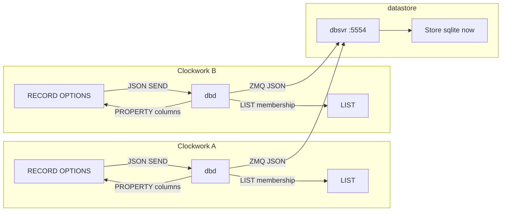

# Clockwork RECORD and native database

**Status:** Draft (implementation in progress: grammar, scaffold, WAL, dbd reconnect, typed JSON, PUB, RECORD_APPLY, COPY-from-class, cw-migrate). Martin 2026-08-24: query results are not a graph of unlinked machines; Clockwork stays a full language (no Lua/Python).  
**Date:** 2026-08-24  
**Author:** (design)  
**Repos:**

| Repo | Path | Role |
| --- | --- | --- |
| Clockwork / iod | this repo | Language, MACHINE/RECORD, `dbd` as DATABASE_CHANNEL adapter |
| datastore | `../datastore` (`github.com/latproc/datastore`) | JSON database server (`dbsvr` on ZMQ `tcp://*:5554`), pluggable `Store` |

This is the published language and datastore spec. Clockwork work is generic (`Customer` / `Order` fixtures). Application programs that use RECORD live in other repos and are not documented here.

---

## Overview

Clockwork already has a working sketch of database access: JSON action messages on `DATABASE_CHANNEL`, a `dbd` daemon that forwards them, and the **datastore** process that actually talks to a database. Early programs used INTERFACE + JSON on that channel; some applications used `WEBREQUEST` and copied JSON into OPTIONS, with a counter so panels know when to refresh.

Those pieces show the intended model: a row should look like a MACHINE, LIST/HMI should work with it, and SQL (or any other backend) stays **out of iod**. What remains is to finish that model so OPTIONS *are* the row, so a commit can reach every Clockwork that holds that RECORD, and so schema (including views) is versioned.

The next step is a **`RECORD` class** (a parser-restricted MACHINE) plus the **existing datastore server**, not a new SQL engine inside `dbd`:

- RECORD is MACHINE with a limitation: no user handlers or states. Lexer/parser stop people adding logic; OPTION-change and dependency tracking already on MACHINE then just work.
- `dbd` stays the Clockwork adapter: subscribe as `DATABASE_CHANNEL`, forward JSON, apply replies onto machines.
- **datastore** (`dbsvr`) is the database process. JSON in, JSON out. `SQLInterface` compiles JSON to SQL for the current sqlite `Store`. Other backends (redis, later others) are a Store swap — that was the point of keeping it separate.
- Clockwork queries stay JSON (`action` / `type` / `keys` / `fields`). Joins and views are datastore + migrations, not SQL strings inside WHEN.
- **Named** RECORD instances are ordinary `MachineInstance`s, so LIST, HMI, and WHEN on machines that take them as parameters already work. A query result is a batch (JSON, then a LIST), not a second graph of unlinked machines.

---

## Background and motivation

### What exists today

| Piece | Location | What it actually does |
| --- | --- | --- |
| Language sketch | `tests/datastore.cw`, `tests/db-channel.cw` | Customer MACHINE with JSON action templates; `SEND request TO DATABASE_CHANNEL`; LOOKUP and result mapping still marked as future work |
| Channel | `database_channel.lpc`, `db-channel.cw` | `DATABASE_CHANNEL` PUBLISHER; `IGNORES STATE_CHANGES, PROPERTY_CHANGES` — only `SEND` JSON moves |
| Clockwork daemon | `iod` `dbd` | Subscribes as `DATABASE_CHANNEL`, forwards payload to `tcp://127.0.0.1:5554`, then `PROPERTY` a JSON blob and `SEND <prop>_changed` |
| Database server | `../datastore` (`dbsvr`) | JSON request/reply on ZMQ REP `:5554`. `SQLInterface::buildSQL` → `Store` (sqlite3 today) |
| Persistence (unrelated) | `PersistentStore`, `persistd` | Key/value dump of properties to `persist.dat`. Not a database. |

`dbd` `send_response_to_clockwork` parses `respond_to` as `machine.property`, sets that property to the JSON response, then sends `response_changed`. That was enough to prove the channel path. RECORD continues from there by applying the same notify path **per column** onto the row MACHINE, so OPTIONS stay in sync. Port 5554 is not a throwaway helper: it is **datastore**.

### datastore (`../datastore`)

Separate project (`git@github.com:latproc/datastore.git`). README: *“A basic data store, using sqlite3 initially, will also eventually support redis and perhaps other databases.”* ZMQ for JSON requests and JSON replies.

`dbsvr` (`dbsvr.cpp`):

- Loads `db_name` from `--config`.
- `Store::getInstance(db_name)->connect(true)`.
- Binds `tcp://*:5554` as ZMQ REP.
- `handleIncomingRequest` → `performRequestMessage`.

JSON protocol:

```
{ "action": "find", "auth": "...", "type": "customer", "keys": { "name": "Fred" }, "fields": ["age"] }
{ "action": "insert", "auth": "...", "type": "customer", "data": { "name": "Fred" } }
{ "action": "update", "auth": "...", "type": "customer", "keys": { "name": "Fred" }, "data": {"age":20} }
{ "action": "delete", "auth": "...", "type": "customer", "keys": { "name": "Bill" } }
{ "action": "create", "auth": "...", "type": "customer", "schema": { "name": "string primary key" } }
{ "action": "sql", "auth": "...", "sql": "…" }
```

Replies: `{ "status": 0|1|2, "request": "…", "response": … }`. Auth token placeholder is `"xxx"` (restrictions intended later).

`SQLInterface` turns `action`/`type`/`keys`/`data`/`fields`/`schema` into SQL. `Store` currently wraps sqlite3 (`prepare`/`step`/`finalize`). A Redis (or other) Store would keep the JSON API and leave Clockwork unchanged.

That is why sqlite should **not** move into `dbd`. Folding the engine into the Clockwork daemon would work for one backend and then fight the intended split.

### INTERFACE + JSON on DATABASE_CHANNEL

Programs already do this: the row MACHINE holds fields, an INTERFACE builds the JSON the channel expects, and `respond_to` is how results come back.

1. HMI or program writes OPTIONS on the row MACHINE.
2. INTERFACE copies OPTIONS into `request` JSON (`ITEM ${data.name} OF request := cust.name`).
3. `SEND request TO DATABASE_CHANNEL`.
4. `dbd` forwards to datastore; the reply comes back via `respond_to`.
5. INTERFACE receives `response` / `response_changed` and stores JSON in `data`.

What we still want from the runtime, which this layer could not provide yet:

- Apply the result onto the **same OPTIONS** that were sent, so a second read is unnecessary.
- `find_all` / query results as a **LIST**, not a JSON blob that the program never walks — but **not** as dynamically created RECORD machines that sit outside the parameter graph (see [Query results and the machine graph](#query-results-and-the-machine-graph)).
- Schema as versioned migrations rather than a runtime `create` JSON payload (`"id": "integer primary key"`).
- One receive-message name for results (`dbd` sends `response_changed`; INTERFACEs currently listen for slightly different messages).
- Field copies that stay aligned with `data.*` vs `keys.*` without a hand-maintained mapper.

RECORD is the language support that makes the row MACHINE the schema. The INTERFACE + JSON path stays valid; it is the proven persist path until something more is specified.

Two Clockworks that both hold a RECORD should see the same OPTIONS after a commit, without a follow-up HTTP GET. After COMMIT, `dbsvr` publishes so the other `dbd` can apply (Q6).

---

## Goals and non-goals

### Goals

1. **`RECORD` class** — MACHINE with no user handlers or states. OPTIONS are columns of a table **or a view**. Parser (lex/bison) enforces the limitation. Existing OPTION-change logic updates dependents.
2. **Row OPTIONS stay in sync** on Clockworks that hold the row, so a write on process A is visible on process B without a follow-up GET.
3. **JSON in Clockwork; backend ops in datastore.** Extend the existing `action`/`type`/`keys`/`fields` protocol (joins, views, filters). Named views in migrations stand in for joined query shapes.
4. **Alembic-like schema management** for tables *and* views: versioned upgrade/downgrade, revision table, CLI, no silent prod auto-mutate.
5. **LIST commands work on named RECORD instances and on query-result LISTs** (`COPY`, `TAKE FIRST`, `SORT BY PROPERTY`, `CLEAR`, `SIZE OF`, ALL/ANY, SUM/MIN/MAX, `SEND TO list`). Reactions to a row go through a **statically declared** RECORD that other machines already depend on, not through `Class#key` instances created at query time.
6. **Non-blocking iod scan:** iod never opens the database file. `dbd` does not become the SQL engine.
7. **Standalone `cw-scaffold`:** from RECORD classes, generate operational Clockwork (`create`/`update`/`find`/`list`/`delete` as an INTERFACE MACHINE). Persist stays off the RECORD body.
8. **Datastore SQLite PRAGMAs:** WAL, `synchronous=NORMAL`, `busy_timeout=5000`, `foreign_keys=ON`; one BEGIN/COMMIT/ROLLBACK per JSON request (Clockwork never sends those).
9. **`dbd`/`dbsvr` survive process restart** (linger 0, REQ deadlines, CHANNEL `forceFullReconnect`). Copy persistd/modbusd, not throwaway REQ contexts.

### Non-goals (this design)

- Making `PersistentStore` / `persistd` a SQL database.
- SQL strings inside WHEN clauses.
- Merging sqlite into `dbd` (monolithic; fights the Store split).
- A new `MachineInstance` subclass or second process loop for RECORD.
- Reimplementing SQL in the Clockwork parser.
- Automatic rename detection in migrations.
- Embedding a Python ORM in iod.
- **Embedding Lua, Python, or any other language in Clockwork.** Clockwork is the language. Query-result processing uses existing LIST operations, states, WHEN, `WAITFOR`, and `COPY PROPERTIES` — not `for` loops in handlers and not a scripting hatch.
- Application domain types in Clockwork source or tests. Those stay in application repos.
- FLAG-style `save`/`load` builtins on RECORD in v1 (generated INTERFACE instead).
- Schema `action: "create"` as the scaffolder “create” command (that JSON is CREATE TABLE; operational create is `insert`).

### Clockwork is generic

Clockwork is a general language. RECORD, `dbd`, `cw-scaffold`, `cw-migrate`, and every test in **this** repo must be domain-neutral (`Customer`, `Order`, `Item`). Application programs live in other repos.

`loadConfig` is **not reentrant** (`MachineClass` tables are process-static; `reset_parser()` does not clear classes). Parser and scaffolder tests are **subprocesses** (`cw --parse-only`, `cw-scaffold`).

---

## Proposed design

### Architecture

```
 Clockwork A                            Clockwork B
┌──────────────────┐                   ┌──────────────────┐
│ RECORD OPTIONS   │                   │ RECORD OPTIONS   │
│ LIST             │                   │ LIST             │
│ dbd              │                   │ dbd              │
└────────┬─────────┘                   └────────┬─────────┘
         │ JSON SEND                            │ JSON SEND
         │ (DATABASE_CHANNEL)                   │
         └──────────────────┬───────────────────┘
                            ▼
                   ┌─────────────────┐
                   │ dbsvr :5554     │   datastore
                   │ Store           │   (sqlite now;
                   │                 │    redis later)
                   └─────────────────┘

 dbd on each iod applies the JSON reply as PROPERTY
 onto RECORD OPTIONS (and LIST membership). iod never
 opens the database file.
```

GitHub / Markdown preview also has the same picture as mermaid:



Keep the three roles:

| Process | Job |
| --- | --- |
| **iod** | RECORD/MACHINE instances, LIST, WHEN on *other* machines, HMI |
| **dbd** | DATABASE_CHANNEL adapter. Forward JSON to `:5554`. Apply reply as PROPERTY (today a blob; next, per column onto OPTIONS) |
| **datastore (`dbsvr`)** | One writer. JSON → Store. sqlite today; redis and others later without changing Clockwork |

Two Clockworks must **not** each open the database file. Two writers would split the RECORD story. **One `dbsvr`** is the shared process.

`dbd` stays out of iod for the same reason as `persistd` / `modbusd`: a backend lock must not stall EtherCAT. Putting sqlite *inside* `dbd` would work for the current Store and then make a Redis (or second) backend a Clockwork change. Leave Store in datastore.

Connection: named database from config (`db_name`). Datastore already reads that. CHANNEL `KEY` as today. Both dbds must be able to reach `dbsvr` `:5554`.

**Fan-out (decided):** datastore is ZMQ REP today — one request, one reply. After COMMIT, `dbsvr` **publishes** the table + key (or the row). Every `dbd` that holds that RECORD applies OPTIONS so A and B stay the same. PUB/SUB uses linger 0 and the same restart rules as dbd REQ. That is **not** a reason to merge sqlite into `dbd`.

### RECORD is MACHINE with a parser limit

FLAG, LIST, VARIABLE are already `MachineClass` plus ordinary `MachineInstance`. PROPERTY changes already call `notifyDependents()`, so WHEN on **other** machines re-evaluates. That is the auto-update path.

RECORD is the right name. Implementation is a **simple lex/bison change** that stops people adding logic. After that, OPTION-change logic should just work. Do **not** add a second internal machine type.

Parser today (`cwlang.ypp`): `SYMBOL STATEMACHINE` is `Name MACHINE { ... }` and creates `new MachineClass($1)`. Builtin FLAG/LIST are also `MachineClass` (`clockwork.cpp`). `MachineInstanceFactory::create` special-cases a few types; everything else is a normal `MachineInstance`.

Add:

- Lexer token `RECORD` (like `MACHINE` / `FLAG`).
- `definition_header: SYMBOL RECORD …` creating a normal `MachineClass`. Schema is **class properties** (`RECORD`, `TABLE`/`VIEW`, `KEY`, `UNIQUE`, `NOT_NULL`), marked private so they are not row columns. Not extra C++ fields on every MACHINE.
- Instances are **normal** `MachineInstance`s. LIST, EXPORT, HMI, and dependency tracking apply unchanged.
- **Reject in a RECORD body:** WHEN, RECEIVE, COMMAND, user states, transitions. OPTIONS only (`KEY` / `LOCAL` / `UNIQUE` / `NOT NULL` as agreed).
- Optional `VIEW "name"` (or `TABLE "name"`) on the class so a RECORD can sit on a join view, not only a base table.
- `KEY` is already a lexer token (CHANNEL). Add `UNIQUE`, `VIEW`, `TABLE`. Do **not** add a `NULL` keyword: `OPTION x NULL` is the symbol `"NULL"` folded to `Value::t_empty` (`tests/null.cw`). Parse `NOT NULL` as `NOT` + symbol `"NULL"`.
- Prefer a separate `record_body` production (OPTIONS only). `COMMAND` inside RECORD is a syntax error.
- `KEY`/`UNIQUE`/`NOT NULL` on a non-RECORD OPTION is an error.
- Disable automatic state changes (like FLAG). Builtin `INIT` stays; no user `on`/`off`.

Grammar:

```
definition_header:
  SYMBOL RECORD record_header_tail parameters

record_header_tail: /* empty */ | VIEW STRINGVAL | TABLE STRINGVAL

record_body:
  OPTION option_settings ';'
| LOCAL OPTION local_option_settings ';'

option_setting:
  SYMBOL value
| SYMBOL value option_annots   # KEY | UNIQUE | NOT NULL
```

Clockwork fixture (generic):

```
Customer RECORD {
    OPTION id 0 KEY;
    OPTION name "";
    OPTION email "";
    OPTION age 0;
    LOCAL OPTION dirty false;
}
cust Customer;
```

Persist stays the proven path until a later comment specifies builtins: INTERFACE + JSON templates + `SEND … TO DATABASE_CHANNEL`. Logic that reacts to the row lives on a **MACHINE** that depends on the RECORD:

```
CustomerEditor MACHINE cust {
    COMMAND create_or_save {
        SEND insert TO DATABASE_CHANNEL;
    }
    COMMAND lookup {
        SEND find TO DATABASE_CHANNEL;
    }
}
```

If save/load later become builtins, follow FLAG: FLAG has `turnOn`/`turnOff` as class transitions, not user WHEN. Do not put `COMMAND save { SAVE SELF }` or `dirty WHEN SELF IS changed` in the RECORD body.

#### MACHINE OVER RECORD (proposal)

Some programs already treat **one MACHINE** as both the row (OPTIONS) and the active object (WHEN, COMMAND, EXPORT, parameters). Composition (`Editor MACHINE cust`) is two instances: HMI and WHEN sit on the editor; `RECORD APPLY` hits `cust`; the author copies or always reads `cust.age`. That is still valid.

**OVER** is for when the existing machine *is* the row. One instance. The RECORD class is the table / template (column OPTIONS). The MACHINE does **not** re-list those OPTIONS; it names which RECORD to load. At parse/load, column OPTIONS are taken from that RECORD class. The MACHINE body adds states, COMMAND, EXPORT, LOCAL, and extra OPTIONS (not columns).

```
Customer RECORD {
    OPTION id 0 KEY;
    OPTION name "";
    OPTION age 0;
}

CustomerPanel MACHINE OVER Customer {
    EXPORT RW name, age;
    EXPORT STATES idle, active;
    EXPORT COMMANDS clear;
    LOCAL OPTION tmp 0;
    OPTION note "";

    active WHEN age > 0;
    idle DEFAULT;

    COMMAND clear { name := ""; age := 0; }
}

cust CustomerPanel (id: 1);
```

`age` is on `Customer`, not redeclared on `CustomerPanel`. `RECORD APPLY` type `customer` writes this instance. WHEN and EXPORT see the same OPTIONS. `COPY ALL FROM Customer` includes `cust`. JSON `type` is the RECORD class (`customer`), not the skin name. Persist stays explicit (INTERFACE). `OPTION PERSISTENT` is persist.dat and is not a column.

Bare `x Customer;` remains legal for data-only rows. RECORD itself still forbids WHEN/COMMAND/states. Logic stays on the MACHINE; the instance wears both.

Syntax (`OVER` vs `INCLUDE RECORD` vs other) and “at most one OVER class per RECORD” are open. Not implemented.

#### OPTIONS = columns

- Persisted OPTIONS: ordinary `OPTION name default`. Default and Clockwork type (`integer`/`string`/`float`/`boolean`/NULL) map through datastore (sqlite: `INTEGER`/`TEXT`/`REAL`/`INTEGER 0/1`/`NULL`; other Stores map their own types).
- `LOCAL OPTION` is **not** a column (ephemeral, same as today).
- `OPTION PERSISTENT` on a RECORD class is ignored or illegal: the table (or Store) is the persistence.
- JSON_VALUE OPTIONS are allowed as text storing JSON (escape hatch, not the primary row model).
- `KEY` / `UNIQUE` / `NOT NULL` annotations on OPTION (new grammar). First `KEY` is the primary key. Composite keys: later if needed; v1 is single-column KEY.
- `NULL` is a real Value, so a `NULL CONSTANT ""` stand-in is no longer needed.

Identity:

- **Named instance** (`cust Customer (id: 1)`) is a bound working row. It is declared in the program, so other machines can take it as a parameter. WHEN on those machines is the reaction path.
- **Registry:** `(database, table, primary_key) → MachineInstance*`. COPY into a LIST **reuses** the named instance for a PK. Never two named machines for one row.
- **`Class#key` (e.g. `Customer#1`)** is a **cache** `RECORD_APPLY` may create when no named instance holds that key, so PUB can land and `COPY ALL FROM Customer` can see the row in memory. It is **not** a parameter of other machines. Do not attach WHEN to it. Drain it onto a named RECORD if reactions are needed (below).

dbd applying per-column PROPERTY is what makes OPTIONS the row. Machines that depend on those **named** OPTIONS already re-check. The author does **not** issue a second FIND for that.

### Writes and “no extra calls”

**Local writes (either Clockwork is the writer):**

1. Program or HMI assigns OPTIONS (`cust.age := 12`). **No database yet.**
2. An explicit persist (INTERFACE `insert`/`update`, or a later builtin) sends JSON on DATABASE_CHANNEL.
3. `dbd` forwards to datastore. `dbsvr` commits in Store.
4. Reply maps onto OPTIONS (per column). `notifyDependents()` runs. There is **no** follow-up GET on that iod.

Implicit write-through on every OPTION assignment is rejected: HMI fills several fields; WHEN on dependents would fire mid-edit. Explicit persist matches INTERFACE COMMAND `insert`/`update`.

**Inbound PROPERTY path:** iod command thread (`IODCommands` PROPERTY). Applying a datastore reply must not bounce back as another persist.

**Other writers during coexistence:** apply through the same JSON API (`dbsvr`) so Clockwork clients can see the write. If another process writes the sqlite file directly, notification is an open fan-out question.

### JSON queries and SQL views

Joined shapes belong in datastore (named views), not in WHEN.

**Where SQL lives:** datastore (`SQLInterface` + Store) and migration files. sqlite already has `JOIN`, `LEFT JOIN`, `CREATE VIEW`, subqueries. A non-SQL Store implements the same JSON actions in its own way.

**Where Clockwork speaks:** JSON, `action` / `type` / `keys` / `fields`:

```
OPTION queue_query JSON_VALUE {
  "action": "select",
  "from": "customer_with_city",
  "where": { "city": "Perth" },
  "order": ["name"],
  "limit": 20
};
```

Ad-hoc join (when a named view does not exist yet) is later (DS-4). Named views are preferred:

```
CREATE VIEW customer_with_city AS
SELECT c.id AS id,
       c.name AS name,
       a.city AS city
FROM customer c
LEFT JOIN address a ON a.customer_id = c.id
…
```

A RECORD can bind to that view:

```
CustomerWithCity RECORD VIEW "customer_with_city" {
    OPTION id 0 KEY;
    OPTION name "";
    OPTION city "";
}
```

`COPY ALL FROM CustomerWithCity TO customers WHERE …` then works. Writes still go to the base table RECORD (or a documented INSTEAD OF trigger later).

**QUERY** (on a MACHINE, not on the RECORD): `QUERY <json> INTO <list>` and `QUERY <json> INTO <record>`. JSON in CW, SQL in datastore. `INTO <list>` is a JSON array that becomes a LIST (`AS LIST` / existing `PUSH ITEMS FROM`). `INTO <record>` applies onto a **named** RECORD.

### LIST integration

LIST members are `MachineInstance*` (`SetOperationAction`, `PopListAction`, `SortListAction`, `IncludeAction`, `UpdateListItemsAction`, `dynamic_value` SUM/MIN/MAX). **Named** RECORD instances participate with **no LIST core changes**.

`COPY ALL FROM RecordClass TO list` copies **held** instances of that class already in this iod (named ones, and any `Class#key` cache). It is **not** a database `find_all`. Hydrate from dbsvr with INTERFACE `load` / `QUERY` first; then COPY.

```
customers LIST;

NoteEditor MACHINE {
    COMMAND refresh {
        CLEAR customers;
        COPY ALL FROM Customer TO customers;
    }
    COMMAND named_ann {
        COPY ALL FROM Customer TO customers WHERE Customer.ITEM.name == "Ann";
    }
}
```

`ITEM` already means “the member being considered” in LIST WHERE clauses (`tests/copy.cw`). Joins belong in the view or in a `QUERY` JSON `join` list, not in WHEN.

`TAKE FIRST FROM customers` then works unchanged.

**Query subscriptions** (a LIST that stays a live query result without re-querying every scan) stay a later piece of the fan-out question.

Instance reuse: COPY INTO a LIST does not destroy a RECORD that is also a named instance or a member of another LIST.

### Query results and the machine graph

The draft line *“`find_all` as a LIST of row machines, not a JSON array on one property”* is still the right *shape* for HMI and LIST commands. It is the **wrong** shape for WHEN.

A machine created at query time (`Customer#1`, or a LIST member that was never declared) is **not a parameter** of any other machine. OPTION changes on it do not re-check WHEN clauses that were compiled against a named `cust`. The program would have to walk the LIST and `CALL` handlers. That is an imperative loop. The next step after that is loops in handlers, then Lua or Python. **That path is closed.** Clockwork is the language.

Process a result set with the operations Clockwork already has. Martin’s sketch, generic names:

```
cust Customer;          # statically declared; other machines MONITOR / take it as a parameter
rows LIST;
monitor Worker cust;    # WHEN / states live here, not on a query-created RECORD

Worker MACHINE input {
    idle DEFAULT;
    busy WHEN input.name != "";
    done STATE;
    # … dependents of `input` already re-check when COPY PROPERTIES lands
}

Drain MACHINE rows, input, monitor {
    COMMAND next {
        x := TAKE FIRST FROM rows;
        WAITFOR monitor IS done;          # previous row finished
        COPY PROPERTIES FROM x TO input;  # named RECORD; WHEN fires
    }
}
```

`WAITFOR` is existing (`tests/test_timer.cw`). `COPY PROPERTIES FROM a TO b` is existing (`tests/copy.cw`). `TAKE FIRST FROM` is existing.

**Generic `json AS LIST`, not RECORD-specific spawn.** Query replies and other JSON arrays should become LISTs the same way, whether or not the objects are RECORD rows. Today that is `PUSH ITEMS FROM json_data TO data` (`tests/json_table.cw`). Prefer a clearer spelling:

```
rows := result AS LIST;     # JSON array → LIST (values or objects)
```

or keep `PUSH ITEMS FROM result TO rows`. Do **not** invent a second “query creates RECORD machines” feature. If a LIST member is a JSON object, copy fields onto the named RECORD (`ITEM ${name} OF x` today; `COPY PROPERTIES FROM x TO input` when `x` is a machine or when COPY PROPERTIES is extended to a JSON object).

`RECORD_APPLY` still updates **named** instances that match `(type, key)` (Q6). Creating `Class#key` when nothing is held stays a cache so PUB and `COPY ALL FROM Class` have somewhere to land. It is not a WHEN target. Do not grow a graph of unlinked machines as the query API.

**HMI:** a LIST of held RECORD instances (named or cache) is still useful for panels. Reactions stay on MACHINEs that depend on a named RECORD.

### Completing `dbd` and datastore (keep the split)

Today `dbd` parses JSON, `client.connect("tcp://127.0.0.1:5554")`, `makeRemoteRequest`, dumps a blob back. That is the right shape.

**dbd next:**

- Keep forwarding `create`/`insert`/`find`/`update`/`delete` JSON to datastore.
- Map a successful row (or rows) onto OPTIONS per column, not only `respond_to` as one JSON property.
- Skip-dirty / no echo persist on inbound PROPERTY.

**datastore next:**

- Parameterized SQL (today `SQLInterface` concatenates; tighten with an identifier allow-list and bound values).
- Richer JSON: `select` / `join` / `view` / `order` / `limit`.
- Store remains sqlite3 until a Redis (or other) Store is written. Clockwork does not care.
- Notify-after-commit: PUB table+key (or row) so every dbd that holds the RECORD applies OPTIONS.

Do **not** open sqlite from `dbd`. Do **not** fold `dbsvr` into the Clockwork tree as “the SQL worker”.

**Datastore gaps today** (generic `customer` tests in that repo):

| # | Issue | Where |
| --- | --- | --- |
| D1 | SQL concatenated; `db_server` **rejects** bind parameters | `sql_interface.cpp`; `db_server.cpp` ~103–106 |
| D2 | Every column is a JSON string; NULL `sqlite3_column_text` is unsafe | `db_server.cpp` ~124–127 |
| D3 | insert/update/delete do not return the row (need `RETURNING` or equivalent) | `performRequestMessage` |
| D4 | JSON null / boolean not emitted as SQL | `collectValuesString` |
| D5–D6 | No `select`/`join`/`order`/`limit`; WHERE is equality-AND only | `buildSQL` |
| D7 | ZMQ REP only today — add PUB after COMMIT (Q6 decided) | `dbsvr.cpp` |
| D8 | `action: "create"` is CREATE TABLE (README is wrong) | `buildSQL` |
| D9 | `action: "sql"` unsandboxed | `buildSQL` |
| D10 | No identifier catalog | new |
| D11 | No test target in CMake | `CMakeLists.txt` |
| D13 | `char buf[1000]` truncates | `buildSQL` |
| D15 | No WAL, no busy timeout, no request transaction | `store.cpp` `connect` |

**SQLite PRAGMAs** on every connect:

```
PRAGMA foreign_keys=ON
PRAGMA journal_mode=WAL
PRAGMA synchronous=NORMAL
PRAGMA busy_timeout=5000
```

Datastore and `cw-migrate` must apply all four. `create_all` on start is not allowed.

One JSON request = one HTTP request: writes `BEGIN IMMEDIATE` … `COMMIT` / `ROLLBACK`; reads `BEGIN DEFERRED` (not IMMEDIATE). Clockwork never sends BEGIN. Retry `SQLITE_BUSY` until busy_timeout. Open `SQLITE_OPEN_READWRITE | SQLITE_OPEN_CREATE`. Fail connect if `journal_mode` is not `wal`. Checkpoint on clean `dbsvr` shutdown.

### ZMQ channels and process restarts

humid/modbusd/persistd already recover CHANNEL setup (`forceFullReconnect`, linger 0, `sendWithDeadline`). **`dbd` does not.** `dbsvr` linger is commented out. Persist will hang or exit on the first bounce unless this is fixed before round-trip tests.

```
iod DATABASE_CHANNEL
        ▲  SubscriptionManager SUB + setup REQ :5555
       dbd
        │  throwaway ZMQ_REQ + new context per request (today)
     dbsvr REP :5554
```

Reply path today creates **another** context + REQ to iod `:5555` and ignores `g_iodcmd`. `STARTUP` from iod does `exit(0)`. Subscriber EFSM/`ENOTSOCK` does `exit(1)`. `makeRemoteRequest` recv is blocking with no deadline. `127.0.0.1:5554` is hardcoded. `dbd.cpp` double-`free`s the message buffer.

REQ/REP does not survive peer restart without linger 0, a deadline, and a **new socket**.

Required:

1. One long-lived dbd context; reuse `g_iodcmd` / `sendWithDeadline` for PROPERTY.
2. Long-lived REQ to `dbsvr`, linger 0, recreate on timeout/EFSM.
3. Configurable `dbsvr` endpoint (default `127.0.0.1:5554`).
4. `dbsvr`: linger 0 on bind; reset REP state on send/recv failure; `EADDRINUSE` retry/log.
5. CHANNEL: `forceFullReconnect` like persistd; STARTUP reconnects in-process (**no `exit(0)`**).
6. Notify-after-commit is PUB (Q6); same linger/timeout rules — not a second silent REQ.

`iod/CMakeLists.txt` only builds `dbd` if `MODBUS_FOUND`. Parser/scaffold tests must not require `dbd`.

### Alembic-like schema (`cw-migrate`)

RECORD classes in `.cw`/`.lpc` are the **table** model. **Views** are first-class migration objects (`CREATE VIEW` SQL), optionally bound to a RECORD with `VIEW "name"`.

Tool name: `cw-migrate`. Lives next to **datastore** (or a small tool that speaks JSON `create` / later migration actions), not as a sqlite helper inside `dbd`.

| Command | Behaviour |
| --- | --- |
| `cw-migrate current --db clockwork.db` | Print `cw_revision` |
| `cw-migrate generate --from-program app.lpc` | Diff loaded RECORD classes vs DB (or last revision); write a new revision file |
| `cw-migrate upgrade [--db] [--rev head]` | Apply SQL |
| `cw-migrate downgrade --rev <id>` | Run downgrade SQL |

Revision files (SQL, not Python), e.g. `db/versions/0001_customer.sql`:

```
-- revision: 0001
-- down_revision: none
-- upgrade
CREATE TABLE customer (
  id INTEGER PRIMARY KEY,
  name TEXT NOT NULL DEFAULT '',
  age INTEGER NOT NULL DEFAULT 0
);
-- downgrade
DROP TABLE customer;
```

Catalog table `cw_revision(version_num TEXT PRIMARY KEY)`. Do not share a sqlite file with another application's migration tool.

Rules:

- Adding an OPTION → `ALTER TABLE … ADD COLUMN` with default.
- Removing an OPTION → explicit revision (not dropped by “load program”).
- Rename → explicit revision only.
- Production does **not** auto-upgrade on iod/dbd/dbsvr start. Operator runs `cw-migrate upgrade`. Mismatch = startup error with expected vs found revision.
- Runtime `"action": "create", "schema": {…}` becomes `cw-migrate` revisions, including `CREATE VIEW` for joined shapes.
- Raw `action: "sql"` is not the migration tool; it may remain a debug hatch.

**Two-migration-system hazard:** do not run `cw-migrate` on a sqlite file owned by another tool. v1: a Clockwork database file of its own.

---

## Language / interface (before → after)

### After (target)

```
Customer RECORD {
    OPTION id 0 KEY;
    OPTION name "";
    OPTION age 0;
}

Order RECORD {
    OPTION id 0 KEY;
    OPTION customer_id 0;
    OPTION total 0;
}

cust Customer;
ord Order;
all_cust LIST;
recent LIST;

CustomerEditor MACHINE cust {
    COMMAND list_all {
        CLEAR all_cust;
        COPY ALL FROM Customer TO all_cust;
    }
    COMMAND queue {
        QUERY JSON_VALUE {
            "action": "select",
            "from": "customer_with_city",
            "where": { "city": "Perth" },
            "order": ["name"]
        } INTO recent;
    }
}

# LIST features on a LIST of held (named) RECORD instances:
#   TAKE FIRST FROM all_cust
#   SORT all_cust BY PROPERTY age
#   COPY ALL FROM all_cust TO subset WHERE all_cust.ITEM.age > 0
# Query INTO list is JSON → AS LIST; drain onto `cust` (named) so WHEN fires:
#   x := TAKE FIRST FROM recent
#   WAITFOR worker IS done
#   COPY PROPERTIES FROM x TO cust
```

Parser additions: `RECORD` (reject logic in the body), optional `VIEW "name"` / `TABLE "name"`, `KEY`/`UNIQUE`/`NOT NULL` on OPTION, `COPY ALL FROM` RECORD-class source. Persist COMMANDs are generated (`cw-scaffold` → `<Class>INTERFACE`); `QUERY` lives on MACHINE if added. `FIND` stays the **iosh** command (`IODCommandFind`). Joins are JSON/`CREATE VIEW`, not new WHEN syntax.

### INTERFACE layer (kept, then generated)

Hand-written INTERFACE + JSON on DATABASE_CHANNEL remains valid. **v1 persist scaffolding is generated.** Standalone `cw-scaffold --from a.cw --out dir/` loads the program with the real parser and emits one `<Class>INTERFACE.lpc` per RECORD. Do not put COMMANDs on the RECORD.

```
CustomerINTERFACE MACHINE record, items {
    OPTION request JSON_VALUE {};
    COMMAND create { … action insert … SEND request TO DATABASE_CHANNEL; }
    COMMAND update { … }
    COMMAND find { … }
    COMMAND list { … find with empty keys until COPY ALL FROM RecordClass exists … }
    COMMAND delete { … }
}
# cust Customer; all_cust LIST; mgr CustomerINTERFACE cust, all_cust;
```

| COMMAND | JSON `action` | Notes |
| --- | --- | --- |
| create | `insert` | Persisted OPTIONS including KEY. **Not** schema `create`. |
| update | `update` | keys = KEY; data = other persisted OPTIONS |
| find | `find` | keys = KEY; fields = persisted OPTIONS |
| list | `find` | keys omitted/`{}` until COPY-from-class |
| delete | `delete` | keys = KEY |

`type` = lowercase class name. `auth` = `"xxx"`. LOCAL omitted. VIEW RECORD: find + list only. Missing KEY on a base-table RECORD: scaffolder error. `COPY ALL FROM SYMBOL` today looks up a **LIST instance** (`SetOperationAction`); do not emit COPY-from-class until that PR.

### IOD / dbd / datastore protocol

Clockwork surface is still JSON on DATABASE_CHANNEL. dbd does not invent a second SQL protocol.

Example find (already valid):

```
{"action":"find","auth":"xxx","type":"customer","keys":{"id":1},
 "fields":["id","name","age"]}
```

dbd applies `response` rows onto OPTIONS of the RECORD instance(s), then dependents re-check.

---

## Data model

v1 tables = one per RECORD class. **Lowercase class name** (`Customer` → `customer`) unless `TABLE "…"`. Scaffolder JSON `type` uses that name.

Plus system tables:

- `cw_revision`
- `cw_change_log` (if external writers exist)

Do not persist a MACHINE state name on a RECORD: RECORD has no user states.

---

## Alternatives considered

| Alternative | Why not (as the primary design) |
| --- | --- |
| Stay on JSON+INTERFACE+datastore only | Proved the channel; results are still one JSON property. RECORD is the next step |
| Fold sqlite into `dbd` | Works for one backend; becomes monolithic; datastore already exists to avoid that |
| A new RECORD `MachineInstance` type | Auto-update already lives on MACHINE; extra type is the wrong complexity |
| Keep HTTP copy into OPTIONS and add push webhooks | Reasonable; still a copy step. Can coexist |
| SQL strings in WHEN / a Clockwork SQL parser | Scan-cycle joins would be slow and hard to sandbox |
| sqlite in each iod | Two processes would split writes; EtherCAT must not block |
| An external ORM as the only engine | Does not give RECORD OPTIONS or inter-CW push |
| Implicit write-through on OPTION assign | Mid-edit writes; dirty loops with inbound PROPERTY; harder HMI |
| RECORD as JSON_VALUE only (no MachineInstance) | LIST features do not apply; WHEN cannot see columns on a named row |
| Query `find_all` spawns a LIST of unlinked `Class#key` machines as the reaction API | LIST/HMI can hold them; WHEN cannot. Forces TAKE/CALL loops, then handler loops, then an embedded language |
| `for` / `foreach` in handlers; embed Lua or Python | Clockwork is the language. Drain a LIST with TAKE FIRST, WAITFOR, COPY PROPERTIES onto a named RECORD |
| Share one sqlite file with another migration tool | Dual heads, guaranteed drift |

---

## Security and privacy

- Auth: CHANNEL `KEY` already exists (`database_channel.lpc`). Datastore’s JSON `auth` placeholder can stay on the shim until token restrictions land.
- JSON → SQL uses an identifier allow-list (tables, views, columns from the catalog) and bound parameters. No concatenated SQL from LPC.
- Raw `action: "sql"` if kept is operator-only and still parameterized; not used for migrations.
- Database file permissions = user that runs **datastore**, not iod.
- Do not log full row payloads at default debug.

---

## Observability

- datastore: log action, type, duration, errors; not full rows at info.
- dbd: log forward latency and PROPERTY apply; `last_error` on the instance if useful.
- Metrics: commit latency, clients connected, PROPERTY apply count.
- `iosh` / `FIND` can list RECORD instances.

---

## Risks

| Risk | Severity | Mitigation |
| --- | --- | --- |
| Dual writers on one sqlite file | High | One `dbsvr`; both iods (via dbd) are clients |
| datastore or LAN down | High | Clockwork keeps last OPTIONS |
| Echo persist between two iods | High | Inbound PROPERTY does not persist again |
| Schema drift vs another app on the same file | High | Separate DB files |
| Instance explosion (`find_all` 100k rows) | Medium | COPY is a COMMAND; cap / paging later |
| PROPERTY storm on wide rows | Medium | Only send changed columns; coalesce per cycle |
| Parser `RECORD` vs user class named RECORD | Low | Keyword; same as MACHINE |
| Dynamic instance lifetime / leaks | Medium | `Class#key` is a cache, not a query API. Named instances never evicted. Do not spawn unlinked machines for WHEN |
| Migration applied on wrong file | High | Refuse mismatch; never auto-upgrade prod |
| Second iod misses a write | High | `dbsvr` PUB after COMMIT; dbd applies onto held RECORDs. Do not “fix” by merging sqlite into dbd |
| REQ/REP hang after iod or dbsvr restart | High | Linger 0, REQ deadline, recreate socket, `forceFullReconnect`; do not `exit` on STARTUP |

---

## Rollout

1. Language: RECORD grammar (no logic in the body) + `cw --parse-only` tests. Generic fixtures only.
2. `cw-scaffold` goldens (`CustomerINTERFACE`).
3. Datastore WAL/transactions + dbd/`dbsvr` ZMQ linger and reconnect.
4. Typed replies / RETURNING; dbd applies rows onto OPTIONS.
5. Two iods / two dbds / one `dbsvr` (client A / client B).
6. `cw-migrate` including `CREATE VIEW`.
7. Application RECORD programs in other repos later.

Rollback: leave RECORD unused; datastore/dbd as today.

---

## Testing

Clockwork tests are **generic language** (`Customer`, `OrderLine`, `CustomerWithAddress`). Do not `loadConfig` two conflicting programs in one process (`loadConfig` is not reentrant). Parser and scaffolder tests are **subprocesses** (`cw --parse-only`, `cw-scaffold`).

- RECORD with OPTIONS parses; WHEN/COMMAND/states in the RECORD body is a parse error.
- `cw-scaffold` goldens: `CustomerINTERFACE` with create=`insert`, update, find, list, delete; VIEW RECORD emits find/list only; LOCAL omitted.
- `RECORD_APPLY` fills OPTIONS by type+key; LOCAL skipped; two instances with the same KEY both update; `Class#key` is registered for lookup.
- PUB notify with a row **array** applies each row (`test_db_notify`); two SUBs both receive (`test_notify`). Two processes each hold `Customer` and apply the same PUB payload to the same OPTIONS (`test_two_process_apply`). Update replies include the row.
- `COPY ALL FROM Customer TO list` then `SIZE OF`, `SORT BY PROPERTY`, `TAKE FIRST` (`test_copy_from_record`).
- Named **VIEW** (not ad-hoc JSON join): `customer_with_city` SELECT + WHERE + ORDER + LIMIT; FK reject; insert returns the row by `rowid`. Queue shape is `select` + `where station` + `order` + `limit` on generic `item`. `station: null` → `IS NULL`; `{"is":"not_null"}` → `IS NOT NULL`; `in` array and bound `like`. COPY ALL FROM a VIEW RECORD class.
- `QUERY q INTO list` and `QUERY JSON_VALUE { … } INTO list` parse as SEND to `DATABASE_CHANNEL` (`record_parse_query_into`, `record_parse_query_into_json`). LIST fill is **not** “spawn unlinked RECORD machines.” Target: JSON array → `AS LIST` / `PUSH ITEMS FROM`, then TAKE FIRST + `COPY PROPERTIES` onto a **named** RECORD. Today RECORD_APPLY still creates `Class#key` as a cache; that is not the reaction path.
- WAL: `journal_mode=wal`; rollback leaves no rows.
- `cw-migrate` upgrade/downgrade including `CREATE VIEW`.
- ZMQ: `DeadlineReq` recreate after peer bounce; `test_dbsvr` restarts `dbsvr` and the next find succeeds (linger 0). Two `dbd` on one PUB both `RECORD_APPLY` (`test_two_dbd`); notify is drained even when CHANNEL is down. `test_cw_system`: two `cw` (cw2cw Link) + two `dbd` + `dbsvr`; insert on A updates `cust` on A and B.
- `cw-migrate generate --sql`; `dbsvr --require-rev` refuses a mismatch and serves when the revision matches.

Still later: iod-elc binaries. Two `cw` + two `dbd` + `dbsvr` is in CI (`test_cw_system`). QUERY INTO still cannot wait for dbsvr inside the scan. `json AS LIST` not started.

C++: datastore `SQLInterface` / Store tests in the datastore repo; dbd apply-OPTIONS tests in `iod/tests/`.

---

## Open questions

These do not block Clockwork RECORD or datastore WAL/ZMQ work.

1. Application cutover (which process is source of truth) is out of this spec.
2. Where `dbsvr` runs relative to the two Clockworks is a deployment choice.
3. ~~Table naming~~ **Decided:** lowercase class name; `TABLE "…"` override.
4. ~~Composite keys in v1~~ **Decided:** single-column `KEY` in v1; composites later (views for multi-column lookup if needed).
5. **QUERY JSON richness in v1:** **named views first** (decided). Ad-hoc `join` arrays later if a view does not exist yet (DS-4). Clockwork gets joined shapes as `CREATE VIEW` + `RECORD VIEW "name"`.
6. ~~Two-Clockwork notify~~ **Decided:** after COMMIT, `dbsvr` **publishes** (table + key, or the row). Every `dbd` that holds that RECORD applies OPTIONS. B must not stay stale. New PUB/SUB uses linger 0 and the same restart rules as dbd REQ. Not a second silent REQ; not poll-until-refresh.
7. ~~Builtin persist~~ **Decided for v1:** generated `<Class>INTERFACE` (`cw-scaffold`), not FLAG-style `save`/`load` on RECORD.
8. **Query results vs WHEN (Martin, 2026-08-24):** a LIST of row machines is fine for HMI and LIST commands. Dynamically created RECORDs are **not** linked, so WHEN does not see them. Drain with `TAKE FIRST` / `WAITFOR` / `COPY PROPERTIES` onto a **statically declared** RECORD that already has dependents. Prefer generic `json AS LIST` (or existing `PUSH ITEMS FROM`) over RECORD-specific spawn. **No** loops in handlers; **no** embedded Lua/Python. Clockwork stays the language. Martin still reading the rest of the design.
9. **MACHINE OVER RECORD (proposal):** one instance that is both the row and the active machine. The MACHINE names a RECORD class (table / template) and does **not** re-list column OPTIONS; those are loaded from the RECORD. Body is states, COMMAND, EXPORT, LOCAL, extra non-column OPTIONS. Alternative is composition (`MACHINE rec`). Open: one instance vs composition only; JSON `type` = RECORD class name; extra OPTIONS never columns; at most one OVER class per RECORD; syntax `OVER` vs `INCLUDE RECORD`; `OPTION PERSISTENT` ignored for columns. Not implemented.

---

## Key decisions

1. **`RECORD` is MACHINE with a lex/bison limit (no user handlers or states).** OPTIONS are columns of a table or view. No new instance type. Builtin `INIT` remains (constructor); no user states.
2. **Keep datastore as the database server; keep `dbd` as the channel adapter.** Do not fold sqlite into `dbd`.
3. **JSON in Clockwork; Store ops in datastore** (sqlite today, other backends later). LPC does not parse SQL. Named views cover joined query shapes.
4. **Explicit persist, not write-through.** Operational CRUD is **generated** by `cw-scaffold` as `<RecordClass>INTERFACE MACHINE record, items`. Scaffolder **create** = JSON `insert`, not schema `create`.
5. **Per-column PROPERTY after a successful reply** — dbd applies by `(type, key)` registry onto RECORD OPTIONS; blob `respond_to` stays for old INTERFACE. Dependents already run. Datastore insert/update replies must include the row (RETURNING or equivalent).
6. **`COPY ALL FROM RecordClass` copies held instances; `QUERY` returns JSON.** FIND stays iosh; WHEN stays off SQL. Query results become a LIST via generic `json AS LIST` / `PUSH ITEMS FROM`, then drain onto a named RECORD (`TAKE FIRST`, `WAITFOR`, `COPY PROPERTIES`). Do not treat `Class#key` spawn as the find_all API. Generated `list` is in-memory COPY; `load` still SEND-find.
7. **Alembic-like revisions including `CREATE VIEW`; no auto-upgrade on start.** `cw-migrate` lives next to datastore.
8. **Do not share a sqlite file with another application's migration tool in v1.**
9. **Clockwork tests and goldens are generic** (`Customer`, …). Application RECORD programs are other repos, later.
10. **Table name = lowercase class name** unless `TABLE "…"`.
11. **Datastore SQLite PRAGMAs:** `foreign_keys=ON`, `journal_mode=WAL`, `synchronous=NORMAL`, `busy_timeout=5000`. Automatic transaction per JSON request.
12. **ZMQ restart:** one dbd context; linger 0; REQ deadlines; recreate on EFSM; `forceFullReconnect` on iod CHANNEL; no `exit` on STARTUP; configurable `dbsvr` endpoint. `dbsvr` linger 0 on REP bind.
13. **Two Clockworks, same RECORD → same OPTIONS.** After COMMIT, `dbsvr` PUBlishes `{type, keys}` or the row; every dbd that holds that instance applies it. Not poll-until-refresh.
14. **Clockwork is the language.** No Lua, Python, or other embed. No `for` in handlers. Query batches drain with TAKE FIRST / WAITFOR / COPY PROPERTIES onto a named RECORD. Generic `json AS LIST`, not find_all-as-unlinked-machines.
15. **RECORD schema is class properties, not MachineClass fields.** `RECORD` / `TABLE` / `VIEW` / `KEY` / `UNIQUE` / `NOT_NULL` on the class (private). Ordinary machines do not carry table or column metadata.

---

## References

- `../datastore` — JSON/ZMQ database server (`dbsvr`, `SQLInterface`, `Store`, README backends)
- `iod` `dbd` — DATABASE_CHANNEL adapter
- `tests/datastore.cw`, `tests/db-channel.cw` — first language sketch for DATABASE_CHANNEL
- `iod/src/clockwork.cpp` FLAG/LIST `MachineClass`, `iod/src/cwlang.ypp` COPY ALL FROM, `MachineInstance::notifyDependents`
- `iod/src/persistd.cpp` / `modbusd.cpp` — linger 0, `sendWithDeadline`, `forceFullReconnect` (pattern for dbd)

---

## Implementation notes (Martin scan)

Code review of the RECORD/dbd slice. Bugs are fixed in the same commit as this note.

| Point | What we did |
| --- | --- |
| `SubscriptionManager` assumes `command_item = num_items - 1` | **Bug.** dbd had `iosh_cmd` then `notify_sub`, so the command slot was the notify socket. Swapped: setup, subscriber, `notify_sub`, **`iosh_cmd` last**. |
| `RECORD_APPLY` in iosh | Intended as a **dbd helper** to apply a row onto held RECORD OPTIONS (yes: automatic update of Clockwork RECORDs). Command is now `RECORD APPLY` / `RECORD REMOVE` (same style as `MODBUS EXPORT`). Dropped from iosh HELP. Underscore aliases still dispatch. |
| MachineClass carries keys, `table_name`, column flags | **Removed.** Schema is class properties (`RECORD`, `TABLE`, `VIEW`, `KEY`, `UNIQUE`, `NOT_NULL`), private so they are not columns. `RecordClass` is a helper over those properties. Ordinary MACHINE classes have no table/key fields. |
| “instance name” on MachineClass | **Misread.** `RecordApply::instanceName()` builds the cache name `Customer#1`. The KEY column is the class property `KEY`. |
| “machines have database notify operations” | Pre-existing `notifyDependents` / command-clock (`notify_period`, `command`, `notify_phase`). RECORD apply uses `setValue` + deferred property notify. Not a new dbsvr API on MachineInstance. |
| Linear scan of all machines on apply | **Fixed.** RECORD instances go on `MachineInstance::record_instances` (same pattern as `command_clocks` / `io_modules`). Apply and COPY-from-class walk that list. A `(type,key)` map is later if RECORD count is large. |
| Give one machine the entire JSON | Matches the drain path (`PUSH ITEMS FROM` / `AS LIST` then COPY PROPERTIES onto a named RECORD). Keep per-column apply for **named** holders (Q6). |
| COPY FROM RECORD only onto a LIST; other ops no-op | **OK for v1.** Errors now say destination missing / not a LIST, not only “no source machine”. |
| `--parse-only` is parse **and** semantic check | Accurate. `loadConfig` always semantic-checks. `-t` does the same then writes the modbus map. `--parse-only` is the no-runtime, no-map path used by tests. Help text updated. |
| Delete notify used RECORD APPLY | **Bug.** dbsvr PUBs `action: delete`. That now becomes `RECORD REMOVE`: drop `Class#key` cache, unlink LISTs; **named** instances stay (program-owned). |
| `setValue` treats `notify_period` / `command` / `notify_phase` as reserved | **Pre-existing** command-clock cache invalidation. Not RECORD. Do not use those names as RECORD columns. |

---

## PR Plan

Clockwork PRs and datastore PRs stay in their own repos. First Clockwork slice does not need `dbsvr`.

### Clockwork

1. **RECORD grammar + subprocess parse tests** — **landed.** `RECORD` body OPTIONS only; `KEY`/`UNIQUE`/`NOT NULL`; `VIEW`/`TABLE`; `cw --parse-only`; fixtures under `iod/tests/fixtures/record/`. KEY on MACHINE is an error; missing KEY on a table RECORD is an error. No dbd/datastore change.
2. **`cw-scaffold` + goldens** — **landed.** `cw-scaffold --from a.cw --out dir/ [--sql]`. INTERFACE: create=`insert`; **list** = `COPY ALL FROM Class TO items`; **load** = JSON `find` with empty keys (hydrate from dbsvr). `--sql` writes `CREATE TABLE` for base RECORDs; VIEW classes only get a comment (join SQL is hand-written). LOCAL omitted. Golden `expected_CustomerINTERFACE.lpc` + `expected_Customer.sql`.
3. **dbd ZMQ recovery** — **landed.** One context; `DeadlineReq` linger 0 + recv deadline + recreate on timeout/EFSM; `--dbsvr` / `--notify`; `forceFullReconnect` on STARTUP (no `exit`); subscriber EFSM/ENOTSOCK reconnects. `test_deadline_req`.
4. **dbd maps typed JSON rows onto RECORD OPTIONS** — **landed.** `RECORD APPLY type keys_json row_json` (`RecordApply`) writes per-column OPTIONS by table+KEY, skips LOCAL, creates `Class#key` if none held. dbd sends `RECORD APPLY` for replies and insert/update PUB. Delete PUB is `RECORD REMOVE`. Blob `respond_to` PROPERTY remains. `test_record_apply`. Not listed in iosh HELP.
5. **Two Clockworks, one datastore** — **landed.** `test_cw_system` runs `dbsvr` + two `dbd` + two `cw` (cw2cw `Link` + `DATABASE_CHANNEL`). Insert on A; both `cust.name` become Ann; A sees shadow `ping_b`. iod-elc still later.
6. **COPY ALL FROM RecordClass INTO LIST** — **landed (in-memory).** Table and VIEW RECORD classes. Scaffolder **list** is COPY; **load** still SEND-find so dbd can materialize rows first.
7. **QUERY INTO** — **parse landed.** `QUERY q INTO list` SENDs JSON property `q` to `DATABASE_CHANNEL` (same as INTERFACE load). `QUERY JSON_VALUE { … } INTO list` SENDs that object. The scan cannot wait for dbsvr. **Next (not started):** treat the reply as JSON and fill the LIST with generic `AS LIST` / `PUSH ITEMS FROM`, then copy onto a named RECORD. Do not finish LIST fill by spawning unlinked `Class#key` machines as WHEN targets.
8. **`json AS LIST`** — **not started.** Existing equivalent: `PUSH ITEMS FROM json TO list` (`tests/json_table.cw`). Add the `AS LIST` spelling if it is clearer; same semantics for any JSON array, not only RECORD rows. Optional: `COPY PROPERTIES FROM` a JSON object onto a named RECORD so field copies are not hand-written `ITEM ${…} OF`.

### Datastore (`../datastore`)

0. **WAL + busy timeout + automatic transactions** — **landed in datastore.** Four PRAGMAs on connect; writable open CREATE; `BEGIN IMMEDIATE` on writes / `BEGIN DEFERRED` on reads; ROLLBACK on error. `test_store_wal` checks `journal_mode=wal` and insert+rollback leaves no rows. `action: sql` may not include BEGIN/COMMIT/ROLLBACK.
0b. **REP linger 0** — **landed.** `ZMQ_LINGER=0` on REP and PUB; EADDRINUSE bind retry; recreate REP on send/recv failure; WAL checkpoint on SIGINT/SIGTERM.
1. **Typed replies, NULL, RETURNING** — **landed.** Column types from sqlite (`INTEGER`/`REAL`/`TEXT`/`NULL`); JSON null/bool on write; insert/update reply is the row via `SELECT` after write (bundled sqlite 3.7 has no `RETURNING`). `test_typed_json`.
2. **Bound parameters + identifier allow-list** — **landed for CRUD.** Identifiers `[A-Za-z_][A-Za-z0-9_]*`; values bound (`?`). `action: sql` stays a raw hatch (still rejects BEGIN/COMMIT/ROLLBACK).
3. **`select` / `order` / `limit` / `where`** — **landed.** Equality, null, `eq`/`neq`/`gt`/`lt`/`ge`/`le`, `in` (array), `like` (bound). `-col` DESC, `limit`. Named views are the join path. Delete replies return the keys.
4. **JSON `join` (optional)** — **not started; not needed for v1.** Joins are named SQL views (`CREATE VIEW` in `cw-migrate`). Clockwork tests use generic `customer_with_city`.
5. **`cw-migrate`** — **landed.** `current` / `upgrade` / `downgrade`; `generate --sql file` wraps a SQL file (from `cw-scaffold --sql`) as the next revision. `0001_customer.sql` + `0002_customer_with_city.sql`. No `--from-program` parser (that is `cw-scaffold --sql`). No auto-upgrade on `dbsvr` start. `dbsvr --require-rev` refuses a mismatch.
6. **PUB after COMMIT** — **landed.** `{action,type,keys,row}` on the notify PUB socket. `test_notify` plus `test_dbsvr` (live REP + PUB).

DS-0 can start in parallel with Clockwork 1. DS-1 before Clockwork 4. DS-3 before COPY-from-class (or COPY finds all and filters in iod).

### Later, other repos (not Clockwork CI)

Application programs may use RECORD. Not Clockwork tests.
