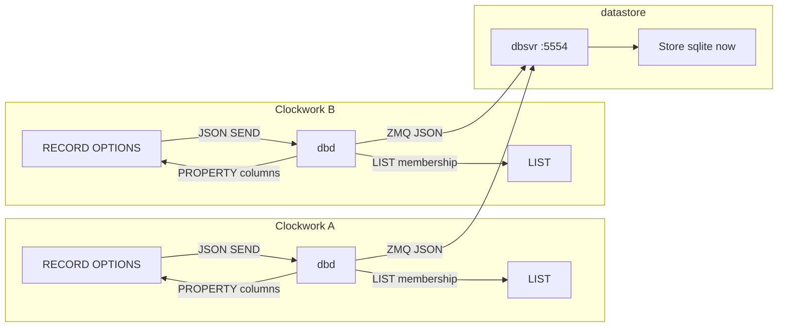

# Clockwork RECORD and native database

**Status:** Draft (implementation in progress: grammar, scaffold, WAL, dbd reconnect, typed JSON, PUB, RECORD_APPLY, COPY-from-class, cw-migrate). Martin 2026-08-24: query results are not a graph of unlinked machines; Clockwork stays a full language (no Lua/Python).  
**Date:** 2026-08-24  
**Author:** (design)  
**Repos:**

| Repo | Path | Role |
| --- | --- | --- |
| Clockwork / iod | this repo | Language, MACHINE/RECORD, `dbd` as DATABASE_CHANNEL adapter |
| datastore | `../datastore` (`github.com/latproc/datastore`) | JSON database server (`dbsvr` on ZMQ `tcp://*:5554`), pluggable `Store` |

This is the published language and datastore spec. Clockwork work is generic (`Customer` / `Order` fixtures). Application programs that use RECORD live in other repos and are not documented here.

---

## Overview

Clockwork already has a working sketch of database access: JSON action messages on `DATABASE_CHANNEL`, a `dbd` daemon that forwards them, and the **datastore** process that actually talks to a database. Early programs used INTERFACE + JSON on that channel; some applications used `WEBREQUEST` and copied JSON into OPTIONS, with a counter so panels know when to refresh.

Those pieces show the intended model: a row should look like a MACHINE, LIST/HMI should work with it, and SQL (or any other backend) stays **out of iod**. What remains is to finish that model so OPTIONS *are* the row, so a commit can reach every Clockwork that holds that RECORD, and so schema (including views) is versioned.

The next step is a **`RECORD` class** (a parser-restricted MACHINE) plus the **existing datastore server**, not a new SQL engine inside `dbd`:

- RECORD is MACHINE with a limitation: no user handlers or states. Lexer/parser stop people adding logic; OPTION-change and dependency tracking already on MACHINE then just work.
- `dbd` stays the Clockwork adapter: subscribe as `DATABASE_CHANNEL`, forward JSON, apply replies onto machines.
- **datastore** (`dbsvr`) is the database process. JSON in, JSON out. `SQLInterface` compiles JSON to SQL for the current sqlite `Store`. Other backends (redis, later others) are a Store swap — that was the point of keeping it separate.
- Clockwork queries stay JSON (`action` / `type` / `keys` / `fields`). Joins and views are datastore + migrations, not SQL strings inside WHEN.
- **Named** RECORD instances are ordinary `MachineInstance`s, so LIST, HMI, and WHEN on machines that take them as parameters already work. A query result is a batch (JSON, then a LIST), not a second graph of unlinked machines.

---

## Background and motivation

### What exists today

| Piece | Location | What it actually does |
| --- | --- | --- |
| Language sketch | `tests/datastore.cw`, `tests/db-channel.cw` | Customer MACHINE with JSON action templates; `SEND request TO DATABASE_CHANNEL`; LOOKUP and result mapping still marked as future work |
| Channel | `database_channel.lpc`, `db-channel.cw` | `DATABASE_CHANNEL` PUBLISHER; `IGNORES STATE_CHANGES, PROPERTY_CHANGES` — only `SEND` JSON moves |
| Clockwork daemon | `iod` `dbd` | Subscribes as `DATABASE_CHANNEL`, forwards payload to `tcp://127.0.0.1:5554`, then `PROPERTY` a JSON blob and `SEND <prop>_changed` |
| Database server | `../datastore` (`dbsvr`) | JSON request/reply on ZMQ REP `:5554`. `SQLInterface::buildSQL` → `Store` (sqlite3 today) |
| Persistence (unrelated) | `PersistentStore`, `persistd` | Key/value dump of properties to `persist.dat`. Not a database. |

`dbd` `send_response_to_clockwork` parses `respond_to` as `machine.property`, sets that property to the JSON response, then sends `response_changed`. That was enough to prove the channel path. RECORD continues from there by applying the same notify path **per column** onto the row MACHINE, so OPTIONS stay in sync. Port 5554 is not a throwaway helper: it is **datastore**.

### datastore (`../datastore`)

Separate project (`git@github.com:latproc/datastore.git`). README: *“A basic data store, using sqlite3 initially, will also eventually support redis and perhaps other databases.”* ZMQ for JSON requests and JSON replies.

`dbsvr` (`dbsvr.cpp`):

- Loads `db_name` from `--config`.
- `Store::getInstance(db_name)->connect(true)`.
- Binds `tcp://*:5554` as ZMQ REP.
- `handleIncomingRequest` → `performRequestMessage`.

JSON protocol:

```
{ "action": "find", "auth": "...", "type": "customer", "keys": { "name": "Fred" }, "fields": ["age"] }
{ "action": "insert", "auth": "...", "type": "customer", "data": { "name": "Fred" } }
{ "action": "update", "auth": "...", "type": "customer", "keys": { "name": "Fred" }, "data": {"age":20} }
{ "action": "delete", "auth": "...", "type": "customer", "keys": { "name": "Bill" } }
{ "action": "create", "auth": "...", "type": "customer", "schema": { "name": "string primary key" } }
```

`action: "create"` is **CREATE TABLE** (`schema`), not a row insert. Operational create is `insert`. `action: "sql"` is **rejected** on the JSON API (use `cw-migrate` or the sqlite CLI).

Replies: `{ "status": 0|1|2, "request": "…", "response": … }`. Auth token placeholder is `"xxx"` (restrictions intended later).

`SQLInterface` turns `action`/`type`/`keys`/`data`/`fields`/`schema` into SQL. `Store` currently wraps sqlite3 (`prepare`/`step`/`finalize`). A Redis (or other) Store would keep the JSON API and leave Clockwork unchanged.

That is why sqlite should **not** move into `dbd`. Folding the engine into the Clockwork daemon would work for one backend and then fight the intended split.

### INTERFACE + JSON on DATABASE_CHANNEL

Programs already do this: the row MACHINE holds fields, an INTERFACE builds the JSON the channel expects, and `respond_to` is how results come back.

1. HMI or program writes OPTIONS on the row MACHINE.
2. INTERFACE copies OPTIONS into `request` JSON (`ITEM ${data.name} OF request := cust.name`).
3. `SEND request TO DATABASE_CHANNEL`.
4. `dbd` forwards to datastore; the reply comes back via `respond_to`.
5. INTERFACE receives `response` / `response_changed` and stores JSON in `data`.

What we still want from the runtime, which this layer could not provide yet:

- Apply the result onto the **same OPTIONS** that were sent, so a second read is unnecessary.
- `find_all` / query results as a **LIST**, not a JSON blob that the program never walks — but **not** as dynamically created RECORD machines that sit outside the parameter graph (see [Query results and the machine graph](#query-results-and-the-machine-graph)).
- Schema as versioned migrations rather than a runtime `create` JSON payload (`"id": "integer primary key"`).
- One receive-message name for results (`dbd` sends `response_changed`; INTERFACEs currently listen for slightly different messages).
- Field copies that stay aligned with `data.*` vs `keys.*` without a hand-maintained mapper.

RECORD is the language support that makes the row MACHINE the schema. The INTERFACE + JSON path stays valid; it is the proven persist path until something more is specified.

Two Clockworks that both hold a RECORD should see the same OPTIONS after a commit, without a follow-up HTTP GET. After COMMIT, `dbsvr` publishes so the other `dbd` can apply (Q6).

---

## Goals and non-goals

### Goals

1. **`RECORD` class** — MACHINE with no user WHEN/COMMAND. OPTIONS are columns of a table **or a view**. Parser (lex/bison) enforces the limitation. Existing OPTION-change logic updates dependents. System states `empty`/`dirty`/`clean` are set by iod/dbd ([Clockwork PR 9](#clockwork-pr-9-record-states-and-apply-projection)).
2. **Row OPTIONS stay in sync** on Clockworks that hold the row, so a write on process A is visible on process B without a follow-up GET.
3. **JSON in Clockwork; backend ops in datastore.** Extend the existing `action`/`type`/`keys`/`fields` protocol (joins, views, filters). Named views in migrations stand in for joined query shapes.
4. **Alembic-like schema management** for tables *and* views: versioned upgrade/downgrade, revision table, CLI, no silent prod auto-mutate.
5. **LIST commands work on named RECORD instances and on query-result LISTs** (`COPY`, `TAKE FIRST`, `SORT BY PROPERTY`, `CLEAR`, `SIZE OF`, ALL/ANY, SUM/MIN/MAX, `SEND TO list`). Reactions to a row go through a **statically declared** RECORD that other machines already depend on, not through `Class#key` instances created at query time.
6. **Non-blocking iod scan:** iod never opens the database file. `dbd` does not become the SQL engine.
7. **Standalone `cw-scaffold`:** from RECORD classes, generate operational Clockwork (`create`/`update`/`find`/`list`/`delete` as an INTERFACE MACHINE). Persist stays off the RECORD body.
8. **Datastore SQLite PRAGMAs:** WAL, `synchronous=NORMAL`, `busy_timeout=5000`, `foreign_keys=ON`; one BEGIN/COMMIT/ROLLBACK per JSON request (Clockwork never sends those).
9. **`dbd`/`dbsvr` survive process restart** (linger 0, REQ deadlines, CHANNEL `forceFullReconnect`). Copy persistd/modbusd, not throwaway REQ contexts.

### Non-goals (this design)

- Making `PersistentStore` / `persistd` a SQL database.
- SQL strings inside WHEN clauses.
- Merging sqlite into `dbd` (monolithic; fights the Store split).
- A new `MachineInstance` subclass or second process loop for RECORD.
- Reimplementing SQL in the Clockwork parser.
- Automatic rename detection in migrations.
- Embedding a Python ORM in iod.
- **Embedding Lua, Python, or any other language in Clockwork.** Clockwork is the language. Query-result processing uses existing LIST operations, states, WHEN, `WAITFOR`, and `COPY PROPERTIES` — not `for` loops in handlers and not a scripting hatch.
- Application domain types in Clockwork source or tests. Those stay in application repos.
- FLAG-style `save`/`load` builtins on RECORD in v1 (generated INTERFACE instead).
- Schema `action: "create"` as the scaffolder “create” command (that JSON is CREATE TABLE; operational create is `insert`).

### Clockwork is generic

Clockwork is a general language. RECORD, `dbd`, `cw-scaffold`, `cw-migrate`, and every test in **this** repo must be domain-neutral (`Customer`, `Order`, `Item`). Application programs live in other repos.

`loadConfig` is **not reentrant** (`MachineClass` tables are process-static; `reset_parser()` does not clear classes). Parser and scaffolder tests are **subprocesses** (`cw --parse-only`, `cw-scaffold`).

---

## Proposed design

### Architecture

```
 Clockwork A                            Clockwork B
┌──────────────────┐                   ┌──────────────────┐
│ RECORD OPTIONS   │                   │ RECORD OPTIONS   │
│ LIST             │                   │ LIST             │
│ dbd              │                   │ dbd              │
└────────┬─────────┘                   └────────┬─────────┘
         │ JSON SEND                            │ JSON SEND
         │ (DATABASE_CHANNEL)                   │
         └──────────────────┬───────────────────┘
                            ▼
                   ┌─────────────────┐
                   │ dbsvr :5554     │   datastore
                   │ Store           │   (sqlite now;
                   │                 │    redis later)
                   └─────────────────┘

 dbd on each iod applies the JSON reply as PROPERTY
 onto RECORD OPTIONS (and LIST membership). iod never
 opens the database file.
```

GitHub / Markdown preview also has the same picture as mermaid:



Keep the three roles:

| Process | Job |
| --- | --- |
| **iod** | RECORD/MACHINE instances, LIST, WHEN on *other* machines, HMI |
| **dbd** | DATABASE_CHANNEL adapter. Forward JSON to `:5554`. Apply reply as PROPERTY (today a blob; next, per column onto OPTIONS) |
| **datastore (`dbsvr`)** | One writer. JSON → Store. sqlite today; redis and others later without changing Clockwork |

Two Clockworks must **not** each open the database file. Two writers would split the RECORD story. **One `dbsvr`** is the shared process.

`dbd` stays out of iod for the same reason as `persistd` / `modbusd`: a backend lock must not stall EtherCAT. Putting sqlite *inside* `dbd` would work for the current Store and then make a Redis (or second) backend a Clockwork change. Leave Store in datastore.

Connection: named database from config (`db_name`). Datastore already reads that. CHANNEL `KEY` as today. Both dbds must be able to reach `dbsvr` `:5554`.

**Fan-out (decided):** datastore is ZMQ REP today — one request, one reply. After COMMIT, `dbsvr` **publishes** the table + key (or the row). Every `dbd` that holds that RECORD applies OPTIONS so A and B stay the same. PUB/SUB uses linger 0 and the same restart rules as dbd REQ. That is **not** a reason to merge sqlite into `dbd`.

### RECORD is MACHINE with a parser limit

FLAG, LIST, VARIABLE are already `MachineClass` plus ordinary `MachineInstance`. PROPERTY changes already call `notifyDependents()`, so WHEN on **other** machines re-evaluates. That is the auto-update path.

RECORD is the right name. Implementation is a **simple lex/bison change** that stops people adding logic. After that, OPTION-change logic should just work. Do **not** add a second internal machine type.

Parser today (`cwlang.ypp`): `SYMBOL STATEMACHINE` is `Name MACHINE { ... }` and creates `new MachineClass($1)`. Builtin FLAG/LIST are also `MachineClass` (`clockwork.cpp`). `MachineInstanceFactory::create` special-cases a few types; everything else is a normal `MachineInstance`.

Add:

- Lexer token `RECORD` (like `MACHINE` / `FLAG`).
- `definition_header: SYMBOL RECORD …` creating a normal `MachineClass`. Schema is **class properties** (`RECORD`, `TABLE`/`VIEW`, `KEY`, `UNIQUE`, `NOT_NULL`), marked private so they are not row columns. Not extra C++ fields on every MACHINE.
- Instances are **normal** `MachineInstance`s. LIST, EXPORT, HMI, and dependency tracking apply unchanged.
- **Reject in a RECORD body:** WHEN, RECEIVE, COMMAND, user states, transitions. OPTIONS only (`KEY` / `LOCAL` / `UNIQUE` / `NOT NULL` as agreed).
- Optional `VIEW "name"` (or `TABLE "name"`) on the class so a RECORD can sit on a join view, not only a base table.
- `KEY` is already a lexer token (CHANNEL). Add `UNIQUE`, `VIEW`, `TABLE`. Do **not** add a `NULL` keyword: `OPTION x NULL` is the symbol `"NULL"` folded to `Value::t_empty` (`tests/null.cw`). Parse `NOT NULL` as `NOT` + symbol `"NULL"`.
- Prefer a separate `record_body` production (OPTIONS only). `COMMAND` inside RECORD is a syntax error.
- `KEY`/`UNIQUE`/`NOT NULL` on a non-RECORD OPTION is an error.
- Disable automatic state changes (like FLAG). Builtin `INIT` stays; no user `on`/`off`. RECORD still has **system states** `empty`, `dirty`, `clean` (below).

Grammar:

```
definition_header:
  SYMBOL RECORD record_header_tail parameters

record_header_tail: /* empty */ | VIEW STRINGVAL | TABLE STRINGVAL

record_body:
  OPTION option_settings ';'
| LOCAL OPTION local_option_settings ';'
| PERSISTENT OPTION persistent_option_settings ';'

option_setting:
  SYMBOL value
| SYMBOL value option_annots   # KEY | UNIQUE | NOT NULL
```

`PERSISTENT` and `LOCAL` are mutually exclusive (parse error). `KEY` / `UNIQUE` / `NOT NULL` belong on a bare `OPTION` (database column), not on `PERSISTENT OPTION` or `LOCAL OPTION`. `PERSISTENT OPTION` in a RECORD body is a **later PR**: the current parser accepts only `OPTION` and `LOCAL OPTION` (iod-9).

Clockwork fixture (generic):

```
Customer RECORD {
    OPTION id 0 KEY;
    OPTION name "";
    OPTION email "";
    OPTION age 0;
}
cust Customer;
```

Looking at `cust` from outside, its Clockwork state is **`empty`**, **`dirty`**, or **`clean`**. Those are **not** WHEN clauses in the RECORD body. iod/dbd set them, the same way CHANNEL sets `DISCONNECTED` / `CONNECTED` / `ACTIVE` and EtherCAT MODULE / `ETHERCAT_LINKSTATUS` set `UP` / `DOWN` (`disableAutomaticStateChanges`; C++ `setState`). The author does not write `dirty WHEN …`.

| State | Who sets it | Meaning |
| --- | --- | --- |
| `empty` | runtime (declare, `RECORD REMOVE`, clear) | no row bound; OPTIONS are class defaults |
| `dirty` | runtime on a local column assign | OPTIONS changed here; not COMMITted |
| `clean` | runtime after APPLY / successful insert-or-update reply | OPTIONS match the last dbsvr row |

`LOCAL OPTION` on a RECORD is still allowed for ephemeral flags the author needs, but the lifecycle is the **state**, not a `state` OPTION. Do not put `COMMAND save` or `dirty WHEN SELF IS changed` in the RECORD body.

`Customer` is the Clockwork **class**. Datastore JSON `type` is the **table or view name** (default lowercase class, here `customer`; override with `TABLE "…"` / `VIEW "…"`). Do not store that name on an ordinary OPTION — OPTIONS are columns, and `OPTION type "piston"` is already a discriminator in existing programs.

Persist stays the proven path until a later comment specifies builtins: INTERFACE + JSON templates + `SEND … TO DATABASE_CHANNEL`. Logic that reacts to the row lives on a **MACHINE** that depends on the RECORD, **or** on a MACHINE that *is* the row (next section):

```
CustomerEditor MACHINE cust {
    COMMAND create_or_save {
        SEND insert TO DATABASE_CHANNEL;
    }
    COMMAND lookup {
        SEND find TO DATABASE_CHANNEL;
    }
}
```

If save/load later become builtins, follow FLAG: FLAG has `turnOn`/`turnOff` as class transitions, not user WHEN.

#### MACHINE bound to a table (proposal)

A MACHINE can **look like a RECORD** (same KEY, same column OPTIONS, same APPLY/COMMIT) and still have **author WHEN / COMMAND** (`Idle` / `InCycle`, …).

RECORD states are **passive** (runtime owns the state slot). MACHINE states are **active** (WHEN owns the state slot). The runtime therefore **cannot** `setState(empty|dirty|clean)` on that MACHINE without fighting WHEN. The row lifecycle on a MACHINE is a **`LOCAL OPTION state`** string; the Clockwork STATE stays the author's.

Do **not** use `OPTION type "Customer"` for the relation name (`type` is a common column/discriminator; `"Customer"` is the class, not the JSON `type`). Bind with a class property `TABLE "…"` or `VIEW "…"`, same as RECORD. List every column the instance should hold. APPLY is a **projection**: set OPTIONS that exist on the machine; ignore extra fields in the row.

```
Customer RECORD TABLE "customer" {
    OPTION id 0 KEY;
    OPTION name "";
    OPTION email "";
    OPTION age 0;
}

CustomerPanel MACHINE TABLE "customer" {
    OPTION id 0 KEY;
    OPTION name "";
    OPTION age 0;                 # projection — email is on the table, not here
    LOCAL OPTION state "empty";   # row lifecycle; Clockwork STATE is idle/active
    LOCAL OPTION tmp 0;           # logic only; not a column, not APPLY, not persist.dat
    OPTION note "";               # extra OPTION: not a column unless the table has it

    EXPORT RW name, age;
    EXPORT STATES idle, active;
    EXPORT COMMANDS clear;

    active WHEN age > 0;
    idle DEFAULT;

    COMMAND clear { name := ""; age := 0; }
}

cust CustomerPanel (id: 1);
```

JSON `type` is `customer`. `RECORD APPLY` matches `(type, key)` onto this instance. WHEN and EXPORT sit on `cust` itself. Bare `x Customer;` remains legal for data-only rows.

A RECORD class is still the place for **canonical schema** (`cw-scaffold`, migrations). It is **not** required for the bind: any MACHINE with `TABLE`/`VIEW` + `OPTION … KEY` is a row. Two machines may bind the same `(type, key)` (two windows on one row).

**Fill** is the same as a RECORD. Declaring `cust CustomerPanel (id: 1)` does **not** read the database. OPTIONS start at class defaults; `state` is `empty`. A row arrives only by an explicit find (INTERFACE `find` / `load`, or `QUERY`) then `RECORD APPLY` (or `COPY PROPERTIES` from a LIST member). Two patterns:

1. **KEY known in the program** — `cust CustomerPanel (id: 1)`. INTERFACE `find` with that KEY. `RECORD APPLY` writes `cust` and sets `state` to `clean`.
2. **Slot, KEY from a query** — `slot CustomerPanel;`. A **loader MACHINE** owns a static selector (e.g. `OPTION city "Perth"`), hydrates (`SEND` find so APPLY fills held rows), `COPY ALL FROM Customer TO occupancy WHERE … city`, then binds: SIZE 0 → `clear` on `slot` (`state` `empty`); SIZE ≥ 1 → `COPY PROPERTIES` / APPLY onto `slot` (`state` `clean`). Notify: loader `load`s again and rebinds.

`QUERY` / INTERFACE `load` are SEND; the scan cannot wait for `dbsvr`. The loader uses its own WHEN / `WAITFOR` for “hydrate done” then bind. Do not treat `COPY ALL FROM Customer` as a database fetch.

Composition (`Editor MACHINE cust`) is still valid: two instances; APPLY hits `cust`; HMI/WHEN sit on the editor. Table-bound MACHINE binds onto `slot` itself.

**Do not `COPY PROPERTIES` of row OPTIONS from one slot to the next** (prev-exit → enter → exit). That is a second copy of the row in memory; the table never moved. Two slots that should show the same row both **bind** to it (same KEY / same APPLY). A real move updates a column the query uses (e.g. `city` / `station`) with INTERFACE `update`, then **each** loader `load`s and rebinds. Cycle-only OPTIONS (`LOCAL`, timers, maps that are not columns) stay on the MACHINE and are not copied as identity.

**EXPORT must be checked at load** (`loadConfig` / `--parse-only`). Unknown OPTION / STATE / COMMAND is an **error**. `EXPORT` of a `LOCAL OPTION` is a **warning** (not a row column). Size/type mismatch is a warning.

**Implemented (2026-08-30):** `TABLE`/`VIEW` on a MACHINE header and `KEY`/`UNIQUE`/`NOT NULL`/`PRIVATE` on a table-bound MACHINE OPTION are parsed; a MACHINE with `TABLE`/`VIEW` + `KEY` is a row. `RECORD APPLY`/`RECORD REMOVE` iterate **all** row classes for a table (RECORD plus any bound MACHINEs), project onto each, and do **not** `setState` on a MACHINE (its STATE stays WHEN-owned; the row lifecycle is the author's `LOCAL OPTION state`). EXPORT load-time checks are also done (unknown OPTION/STATE/COMMAND is an error; LOCAL-OPTION export is a warning).

#### Using the examples

`CustomerINTERFACE` is `cw-scaffold` output. `QUERY` / INTERFACE are SEND.

`WAITFOR` has **no timeout** (`WaitForAction::checkComplete` stays `Running` until the predicate is true). A silent dbd/`dbsvr` miss never unblocks it. `ABORT`/`RETURN` later in the same COMMAND do not run while WAITFOR is blocked. `CALL … ON TIMEOUT msg` is parsed (`tests/call.lpc`) but `CallMethodAction` does not schedule a timer — the source comment is “hangs forever”; `timeout_msg` only fires if the CALL **Fails**. `ON TIMEOUT` / `MachineCommand::timeout` / `timeout_trigger` are unused. `tests/abort.cw` is marked known-fail.

The pattern that **is** written and tested is WHEN + TIMER, then DISABLE (see `tests/arith.cw`, `tests/unit/command_guards.cw`, `tests/test_web_request.cw`):

```
CustomerEditor MACHINE cust, db {
    OPTION timeout 5000;
    missing WHEN cust IS empty;
    unsaved WHEN cust IS dirty;
    ready WHEN cust IS clean;
    error WHEN SELF IS waiting AND TIMER >= timeout;
    waiting DEFAULT;

    COMMAND load { CALL find ON db; }          # no WAITFOR; ready WHEN fires on APPLY
    COMMAND abort { DISABLE SELF; ENABLE SELF; }
    ENTER error { CALL abort ON SELF; }
}
```

~~Ask Martin whether WAITFOR should grow a timeout, or whether RECORD examples should stay on WHEN/TIMER.~~ **Decided (2026-08-31):** WAITFOR grows a timeout with `ON TIMEOUT ABORT | RETURN | THROW <msg>` (see [Clockwork PR 11](#clockwork-pr-11-waitfor--call-timeout-q11-iod-15--proposed)). Below still uses WAITFOR as in his drain sketch.

```
# --- named RECORD (passive states empty/dirty/clean) ---
cust Customer (id: 1);
customers LIST;
db CustomerINTERFACE cust, customers;

CustomerEditor MACHINE cust, db {
    missing WHEN cust IS empty;
    unsaved WHEN cust IS dirty;
    ready WHEN cust IS clean;
    waiting DEFAULT;

    COMMAND load {
        CALL find ON db;
        WAITFOR cust IS clean;
    }
    COMMAND save {
        CALL update ON db;
        WAITFOR cust IS clean;
    }
    COMMAND rename {
        cust.name := "Ann";     # local; cust → dirty
        CALL update ON db;      # persist; APPLY → clean
    }
    COMMAND make {
        cust.name := "Ann";
        cust.email := "ann@example.com";
        cust.age := 20;
        CALL create ON db;      # insert
        WAITFOR cust IS clean;
    }
}
ed CustomerEditor cust, db;


# --- same row on a MACHINE (active WHEN; lifecycle is panel.state) ---
panel CustomerPanel (id: 1);

# find on db APPLYs type=customer key=1 onto *both* cust and panel:
#   cust gets id, name, email, age
#   panel gets id, name, age (email ignored). panel.state = "clean"
#   panel is idle/active from WHEN age — not empty/dirty/clean

PanelUser MACHINE panel, db {
    COMMAND load {
        CALL find ON db;
        WAITFOR panel.state == "clean";
    }
    COMMAND bump {
        panel.age := panel.age + 1;   # panel.state "dirty"; WHEN may go active
        CALL update ON db;
        WAITFOR panel.state == "clean";
    }
    COMMAND wipe { CALL clear ON panel; }    # author COMMAND, not DELETE
}
u PanelUser panel, db;


# --- QUERY list, drain onto the named RECORD (WHEN lives on ed, not Customer#…) ---
Drain MACHINE customers, cust {
    COMMAND queue {
        QUERY JSON_VALUE {
            "action": "select", "from": "customer",
            "where": { "age": { "gt": 0 } }, "order": ["name"]
        } INTO customers;
    }
    COMMAND next {
        x := TAKE FIRST FROM customers;
        COPY PROPERTIES FROM x TO cust;
        WAITFOR cust IS clean;
    }
}
drain Drain customers, cust;


# --- slot: KEY from a query; two windows, one row; never COPY slot-to-slot ---
enter CustomerPanel;
exit  CustomerPanel;
occupancy LIST;

SlotLoader MACHINE slot, occupancy {
    idle DEFAULT;
    occupied WHEN SIZE OF occupancy >= 1;
    vacant WHEN SIZE OF occupancy == 0;

    COMMAND refresh {
        QUERY JSON_VALUE {
            "action": "find", "type": "customer", "auth": "xxx",
            "keys": { "id": 1 }
        } INTO occupancy;
    }
    ENTER occupied {
        x := TAKE FIRST FROM occupancy;
        COPY PROPERTIES FROM x TO slot;     # bind; slot.state "clean"
    }
    ENTER vacant {
        CALL clear ON slot;                 # slot.state "empty"
    }
}
in_loader  SlotLoader enter, occupancy;
out_loader SlotLoader exit, occupancy;      # same occupancy / same KEY

# rebind enter to another KEY. never COPY PROPERTIES FROM enter TO exit
Rebind MACHINE enter, db {
    COMMAND show_two {
        enter.id := 2;
        CALL find ON db;                    # APPLY (type, 2) onto enter
        WAITFOR enter.state == "clean";
    }
}
```

**HMI edit is local until save.** Several PROPERTY writes → `dirty`. No JSON until `update`.

```
# panel is exported; humid writes name, then age.
# after first write: panel.state "dirty", still idle if age==0
# after age := 21: WHEN → active, still not in sqlite
# CALL update ON db: JSON data is name+age (+id key). email, note, tmp omitted.
```

**LOCAL / extra OPTION are not columns.**

```
WhatPersists MACHINE panel, db {
    COMMAND touch {
        panel.tmp := 1;          # LOCAL: not APPLY, not update payload
        panel.note := "hello";   # not in table "customer" → not a column
        panel.name := "Ann";     # column → dirty; only this (and KEY) go on update
        CALL update ON db;
    }
}
```

**Delete vs clear.** `delete` removes the sqlite row. The named instance stays (program-owned) and goes `empty`. `RECORD REMOVE` drops `Customer#key` cache and unlinks LISTs.

```
DeleteDemo MACHINE cust, db, customers {
    COMMAND forget {
        CALL delete ON db;
        WAITFOR cust IS empty;       # named cust still exists; OPTIONS are defaults
        CALL list ON db;             # COPY ALL FROM Customer TO customers — cache gone
    }
    COMMAND wipe_only {
        cust.name := "";
        cust.age := 0;               # dirty, row still in sqlite until update/delete
    }
}
```

**In-memory list is not find_all.** `load` hydrates from dbsvr (APPLY, including `Customer#key` cache). `list` copies what this iod already holds.

```
ListDemo MACHINE db, customers {
    COMMAND hydrate { CALL load ON db; }     # SEND find keys={}
    COMMAND show {
        CALL list ON db;                     # CLEAR + COPY ALL FROM Customer TO customers
    }
}
# HMI binds to `customers`. Do not WHEN on customers.ITEM — drain onto `cust`.
```

**Two named holders, one KEY.** One APPLY writes both. Same on the other Clockwork after PUB.

```
# iod A
cust_a Customer (id: 1);
panel_a CustomerPanel (id: 1);
db_a CustomerINTERFACE cust_a, customers;

# iod B  (same dbsvr; own dbd SUB)
cust_b Customer (id: 1);
panel_b CustomerPanel (id: 1);

# on A:
cust_a.name := "Ann";
CALL update ON db_a;
# after COMMIT, dbsvr PUB {type:customer, keys:{id:1}, …}
# dbd B: RECORD APPLY → cust_b.name "Ann", panel_b.name "Ann" (no email on panel)
# cust_a and cust_b both clean. No poll, no second find.
```

**VIEW is read-only.** Writes go to the base table RECORD.

```
CustomerWithCity RECORD VIEW "customer_with_city" {
    OPTION id 0 KEY;
    OPTION name "";
    OPTION city "";
}

row CustomerWithCity (id: 1);
cust Customer (id: 1);
cities LIST;

ViewDemo MACHINE row, cust, db {
    COMMAND show_perth {
        QUERY JSON_VALUE {
            "action": "select", "from": "customer_with_city",
            "where": { "city": "Perth" }
        } INTO cities;
    }
    COMMAND load_row { CALL find ON db; }    # APPLY onto cust; view row filled if same KEY
    COMMAND rename {
        cust.name := "Ann";                  # write the table
        CALL update ON db;
    }
}
```

**Move is an UPDATE of a column, then loaders rebind.** Not COPY along a line. (`station` is a column on this RECORD.)

```
Pallet RECORD {
    OPTION id 0 KEY;
    OPTION station "";
    OPTION name "";
}

here Pallet;
there Pallet;
all LIST;
here_list LIST;
there_list LIST;

StationLoader MACHINE slot, occupancy, all {
    OPTION station "";
    hydrating WHEN SIZE OF all == 0 AND TIMER < 2000;
    vacant WHEN SIZE OF occupancy == 0;
    occupied WHEN SIZE OF occupancy >= 1;
    COMMAND refresh {
        QUERY JSON_VALUE {
            "action": "find", "type": "pallet", "auth": "xxx", "keys": {}
        } INTO all;
    }
    ENTER occupied {
        x := TAKE FIRST FROM occupancy;
        COPY PROPERTIES FROM x TO slot;
    }
    ENTER vacant { slot.station := ""; slot.name := ""; }
    # after QUERY APPLYs Pallet rows, filter this station:
    COMMAND bind {
        CLEAR occupancy;
        COPY ALL FROM Pallet TO occupancy WHERE Pallet.ITEM.station == station;
    }
}

at_here  StationLoader here, here_list, all (station: "HERE");
at_there StationLoader there, there_list, all (station: "THERE");

MovePallet MACHINE here, db, at_here, at_there {
    COMMAND advance {
        here.station := "THERE";
        CALL update ON db;           # one row moved
        CALL refresh ON at_here; CALL bind ON at_here;     # HERE empty
        CALL refresh ON at_there; CALL bind ON at_there;   # THERE binds that KEY
        # never COPY PROPERTIES FROM here TO there
    }
}
```

**persist.dat is not the database.** `PERSISTENT OPTION` survives iod restart via persistd. Table OPTIONS survive via dbsvr.

```
Setpoint MACHINE {
    PERSISTENT OPTION sp 0;      # persist.dat only
    OPTION pv 0;                 # RAM (unless this class is TABLE-bound)
}
# Do not mark the same field PERSISTENT OPTION and a table column.
```

**Composition still works** if you want WHEN off the RECORD.

```
Watcher MACHINE cust {
    quiet WHEN cust IS empty;
    hold WHEN cust IS dirty;
    live WHEN cust IS clean;
}
w Watcher cust;
# APPLY/PUB still hit `cust`. w only re-checks.
```

#### OPTIONS = columns

- **Bare `OPTION name default`:** a database column if the class is a RECORD or a `TABLE`/`VIEW` MACHINE. Default and Clockwork type (`integer`/`string`/`float`/`boolean`/NULL) map through datastore (sqlite: `INTEGER`/`TEXT`/`REAL`/`INTEGER 0/1`/`NULL`; other Stores map their own types).
- **`LOCAL OPTION`:** not a column, not APPLY, not COMMIT payload, not persist.dat. Use this for logic that must not be pushed around (scratch, timers, maps, the MACHINE row-lifecycle `state` string). Same as today.
- **`PERSISTENT OPTION`:** persist.dat via persistd, **only that field**. Mutually exclusive with `LOCAL`. Not a database column. `KEY` is not valid here.
- **`OPTION PERSISTENT true`:** existing **machine flag** (reserved name `PERSISTENT`): persistd dumps **all** non-LOCAL properties. Keep for current plugins. If the class lists any `PERSISTENT OPTION`, only those fields go to persistd (`OPTION PERSISTENT true` is then redundant/illegal). A table-bound class must not persist the same columns through both persistd and dbsvr.
- **`OPTION PERSISTENT` on a RECORD / `TABLE` class** for a column is ignored or illegal: the table (or Store) is the persistence.
- There is **no `PRIVATE OPTION`**. The lexer token `PRIVATE` already errors and tells the author to use `LOCAL`. CONSTANT still supports `(private:true)` to hide a value from HMI/describe; that is display, not “not a column.” Schema names `RECORD` / `TABLE` / `VIEW` / `KEY` are class properties marked private in C++ so they are not treated as columns — that is not a language `PRIVATE`.
- JSON_VALUE OPTIONS are allowed as text storing JSON (escape hatch, not the primary row model).
- `KEY` / `UNIQUE` / `NOT NULL` annotations on a bare OPTION (new grammar). First `KEY` is the primary key. Composite keys: later if needed; v1 is single-column KEY.
- `NULL` is a real Value, so a `NULL CONSTANT ""` stand-in is no longer needed.
- **APPLY is a projection.** Only OPTIONS listed on the instance are written. Extra fields in the JSON row are ignored. The instance never grows OPTIONS from the table.

Identity:

- **Named instance** (`cust Customer (id: 1)`) is a bound working row. It is declared in the program, so other machines can take it as a parameter. WHEN on those machines is the reaction path.
- **Registry:** `(database, table, primary_key) → MachineInstance*`. COPY into a LIST **reuses** the named instance for a PK. Never two named machines for one row.
- **`Class#key` (e.g. `Customer#1`)** is a **cache** `RECORD_APPLY` may create when no named instance holds that key, so PUB can land and `COPY ALL FROM Customer` can see the row in memory. It is **not** a parameter of other machines. Do not attach WHEN to it. Drain it onto a named RECORD if reactions are needed (below).

dbd applying per-column PROPERTY is what makes OPTIONS the row. Machines that depend on those **named** OPTIONS already re-check. The author does **not** issue a second FIND for that.

### Writes and “no extra calls”

**Local writes (either Clockwork is the writer):**

1. Program or HMI assigns OPTIONS (`cust.age := 12`). **No database yet.**
2. An explicit persist (INTERFACE `insert`/`update`, or a later builtin) sends JSON on DATABASE_CHANNEL.
3. `dbd` forwards to datastore. `dbsvr` commits in Store.
4. Reply maps onto OPTIONS (per column). `notifyDependents()` runs. There is **no** follow-up GET on that iod.

Implicit write-through on every OPTION assignment is rejected: HMI fills several fields; WHEN on dependents would fire mid-edit. Explicit persist matches INTERFACE COMMAND `insert`/`update`.

**Inbound PROPERTY path:** iod command thread (`IODCommands` PROPERTY). Applying a datastore reply must not bounce back as another persist.

**Other writers during coexistence:** apply through the same JSON API (`dbsvr`) so Clockwork clients can see the write. If another process writes the sqlite file directly, notification is an open fan-out question.

### JSON queries and SQL views

Joined shapes belong in datastore (named views), not in WHEN.

**Where SQL lives:** datastore (`SQLInterface` + Store) and migration files. sqlite already has `JOIN`, `LEFT JOIN`, `CREATE VIEW`, subqueries. A non-SQL Store implements the same JSON actions in its own way.

**Where Clockwork speaks:** JSON, `action` / `type` / `keys` / `fields`:

```
OPTION queue_query JSON_VALUE {
  "action": "select",
  "from": "customer_with_city",
  "where": { "city": "Perth" },
  "order": ["name"],
  "limit": 20
};
```

Ad-hoc join (when a named view does not exist yet) is later (DS-4). Named views are preferred:

```
CREATE VIEW customer_with_city AS
SELECT c.id AS id,
       c.name AS name,
       a.city AS city
FROM customer c
LEFT JOIN address a ON a.customer_id = c.id
…
```

A RECORD can bind to that view:

```
CustomerWithCity RECORD VIEW "customer_with_city" {
    OPTION id 0 KEY;
    OPTION name "";
    OPTION city "";
}
```

`COPY ALL FROM CustomerWithCity TO customers WHERE …` then works. Writes still go to the base table RECORD (or a documented INSTEAD OF trigger later).

**QUERY** (on a MACHINE, not on the RECORD): `QUERY <json> INTO <list>` and `QUERY <json> INTO <record>`. JSON in CW, SQL in datastore. `INTO <list>` is a JSON array that becomes a LIST (`AS LIST` / existing `PUSH ITEMS FROM`). `INTO <record>` applies onto a **named** RECORD.

### LIST integration

LIST members are `MachineInstance*` (`SetOperationAction`, `PopListAction`, `SortListAction`, `IncludeAction`, `UpdateListItemsAction`, `dynamic_value` SUM/MIN/MAX). **Named** RECORD instances participate with **no LIST core changes**.

`COPY ALL FROM RecordClass TO list` copies **held** instances of that class already in this iod (named ones, and any `Class#key` cache). It is **not** a database `find_all`. Hydrate from dbsvr with INTERFACE `load` / `QUERY` first; then COPY.

```
customers LIST;

NoteEditor MACHINE {
    COMMAND refresh {
        CLEAR customers;
        COPY ALL FROM Customer TO customers;
    }
    COMMAND named_ann {
        COPY ALL FROM Customer TO customers WHERE Customer.ITEM.name == "Ann";
    }
}
```

`ITEM` already means “the member being considered” in LIST WHERE clauses (`tests/copy.cw`). Joins belong in the view or in a `QUERY` JSON `join` list, not in WHEN.

`TAKE FIRST FROM customers` then works unchanged.

**Query subscriptions** (a LIST that stays a live query result without re-querying every scan) stay a later piece of the fan-out question.

Instance reuse: COPY INTO a LIST does not destroy a RECORD that is also a named instance or a member of another LIST.

### Query results and the machine graph

The draft line *“`find_all` as a LIST of row machines, not a JSON array on one property”* is still the right *shape* for HMI and LIST commands. It is the **wrong** shape for WHEN.

A machine created at query time (`Customer#1`, or a LIST member that was never declared) is **not a parameter** of any other machine. OPTION changes on it do not re-check WHEN clauses that were compiled against a named `cust`. The program would have to walk the LIST and `CALL` handlers. That is an imperative loop. The next step after that is loops in handlers, then Lua or Python. **That path is closed.** Clockwork is the language.

Process a result set with the operations Clockwork already has. Martin’s sketch, generic names:

```
cust Customer;          # statically declared; other machines MONITOR / take it as a parameter
rows LIST;
monitor Worker cust;    # WHEN / states live here, not on a query-created RECORD

Worker MACHINE input {
    idle DEFAULT;
    busy WHEN input.name != "";
    done STATE;
    # … dependents of `input` already re-check when COPY PROPERTIES lands
}

Drain MACHINE rows, input, monitor {
    COMMAND next {
        x := TAKE FIRST FROM rows;
        WAITFOR monitor IS done;          # previous row finished
        COPY PROPERTIES FROM x TO input;  # named RECORD; WHEN fires
    }
}
```

`WAITFOR` is existing (`tests/test_timer.cw`). `COPY PROPERTIES FROM a TO b` is existing (`tests/copy.cw`). `TAKE FIRST FROM` is existing.

**Generic `json AS LIST`, not RECORD-specific spawn.** Query replies and other JSON arrays should become LISTs the same way, whether or not the objects are RECORD rows. Today that is `PUSH ITEMS FROM json_data TO data` (`tests/json_table.cw`). Prefer a clearer spelling:

```
rows := result AS LIST;     # JSON array → LIST (values or objects)
```

or keep `PUSH ITEMS FROM result TO rows`. Do **not** invent a second “query creates RECORD machines” feature. If a LIST member is a JSON object, copy fields onto the named RECORD (`ITEM ${name} OF x` today; `COPY PROPERTIES FROM x TO input` when `x` is a machine or when COPY PROPERTIES is extended to a JSON object).

`RECORD_APPLY` still updates **named** instances that match `(type, key)` (Q6). Creating `Class#key` when nothing is held stays a cache so PUB and `COPY ALL FROM Class` have somewhere to land. It is not a WHEN target. Do not grow a graph of unlinked machines as the query API.

**HMI:** a LIST of held RECORD instances (named or cache) is still useful for panels. Reactions stay on MACHINEs that depend on a named RECORD.

### Completing `dbd` and datastore (keep the split)

Today `dbd` parses JSON, `client.connect("tcp://127.0.0.1:5554")`, `makeRemoteRequest`, dumps a blob back. That is the right shape.

**dbd next:**

- Keep forwarding `create`/`insert`/`find`/`update`/`delete` JSON to datastore.
- Map a successful row (or rows) onto OPTIONS per column, not only `respond_to` as one JSON property.
- Skip-dirty / no echo persist on inbound PROPERTY.

**datastore remaining:** none of the original D1–D15 list. This slice closed D8–D10 (README, reject `action: "sql"`, identifier catalog).

**datastore later (not this slice):**

- JSON `join` arrays — **not v1.** Joins are named SQL views (`CREATE VIEW` in `cw-migrate`).
- Store remains sqlite3 until a Redis (or other) Store is written. Clockwork does not care.

Do **not** open sqlite from `dbd`. Do **not** fold `dbsvr` into the Clockwork tree as “the SQL worker”.

**Datastore gaps** (generic `customer` tests in that repo):

| # | Issue | Status |
| --- | --- | --- |
| D1 | SQL concatenated; binds rejected | **Landed.** `?` placeholders + `bindAll` |
| D2 | Every column a JSON string; NULL text unsafe | **Landed.** `columnToJson` by sqlite type |
| D3 | insert/update/delete do not return the row | **Landed.** `INSERT`/`UPDATE`/`DELETE … RETURNING *` (bundled sqlite upgraded to 3.46) |
| D4 | JSON null / boolean not emitted as SQL | **Landed.** `bindFromJson` |
| D5–D6 | No `select`/`join`/`order`/`limit`; WHERE equality-AND only | **Landed** except JSON `join`. `select` + `order`/`limit` + WHERE `eq`/`neq`/`gt`/`lt`/`ge`/`le`/`in`/`like`/`is`. Joins = named views |
| D7 | ZMQ REP only — add PUB after COMMIT | **Landed.** PUB `--notify-port` (default 5556) |
| D8 | `action: "create"` is CREATE TABLE (README is wrong) | **Landed.** `create` stays CREATE TABLE; README documents that. Row create is `insert` |
| D9 | `action: "sql"` unsandboxed | **Landed.** JSON API rejects `action: "sql"`. Migrations = `cw-migrate`; operator SQL = sqlite CLI |
| D10 | No identifier catalog | **Landed.** Table/view in `sqlite_master`; columns in `PRAGMA table_info`. `create` is lexical-only |
| D11 | No test target in CMake | **Landed.** `test_store_wal`, `test_typed_json`, `test_notify`, `test_select_view`, `test_cw_migrate`, `test_dbsvr` |
| D13 | `char buf[1000]` truncates | **Landed.** Buffer is `sql.size() + 1` |
| D15 | No WAL, busy timeout, or request transaction | **Landed.** Four PRAGMAs; `BEGIN IMMEDIATE` / `DEFERRED`; checkpoint on shutdown |

**SQLite PRAGMAs** on every connect:

```
PRAGMA foreign_keys=ON
PRAGMA journal_mode=WAL
PRAGMA synchronous=NORMAL
PRAGMA busy_timeout=5000
```

Datastore and `cw-migrate` must apply all four. `create_all` on start is not allowed.

One JSON request = one HTTP request: writes `BEGIN IMMEDIATE` … `COMMIT` / `ROLLBACK`; reads `BEGIN DEFERRED` (not IMMEDIATE). Clockwork never sends BEGIN. Retry `SQLITE_BUSY` until busy_timeout. Open `SQLITE_OPEN_READWRITE | SQLITE_OPEN_CREATE`. Fail connect if `journal_mode` is not `wal`. Checkpoint on clean `dbsvr` shutdown.

### ZMQ channels and process restarts

humid/modbusd/persistd already recover CHANNEL setup (`forceFullReconnect`, linger 0, `sendWithDeadline`). **dbd and `dbsvr` restart: landed** (one dbd context, `DeadlineReq`, linger 0 on REP/PUB, recreate on EFSM, STARTUP reconnects, `--dbsvr` / `--notify`). The original defect was:

```
iod DATABASE_CHANNEL
        ▲  SubscriptionManager SUB + setup REQ :5555
       dbd
        │  throwaway ZMQ_REQ + new context per request (today)
     dbsvr REP :5554
```

Reply path today creates **another** context + REQ to iod `:5555` and ignores `g_iodcmd`. `STARTUP` from iod does `exit(0)`. Subscriber EFSM/`ENOTSOCK` does `exit(1)`. `makeRemoteRequest` recv is blocking with no deadline. `127.0.0.1:5554` is hardcoded. `dbd.cpp` double-`free`s the message buffer.

REQ/REP does not survive peer restart without linger 0, a deadline, and a **new socket**.

Required:

1. One long-lived dbd context; reuse `g_iodcmd` / `sendWithDeadline` for PROPERTY.
2. Long-lived REQ to `dbsvr`, linger 0, recreate on timeout/EFSM.
3. Configurable `dbsvr` endpoint (default `127.0.0.1:5554`).
4. `dbsvr`: linger 0 on bind; reset REP state on send/recv failure; `EADDRINUSE` retry/log.
5. CHANNEL: `forceFullReconnect` like persistd; STARTUP reconnects in-process (**no `exit(0)`**).
6. Notify-after-commit is PUB (Q6); same linger/timeout rules — not a second silent REQ.

`iod/CMakeLists.txt` only builds `dbd` if `MODBUS_FOUND`. Parser/scaffold tests must not require `dbd`.

### Alembic-like schema (`cw-migrate`)

RECORD classes in `.cw`/`.lpc` are the **table** model. **Views** are first-class migration objects (`CREATE VIEW` SQL), optionally bound to a RECORD with `VIEW "name"`.

Tool name: `cw-migrate`. Lives next to **datastore** (or a small tool that speaks JSON `create` / later migration actions), not as a sqlite helper inside `dbd`.

| Command | Behaviour |
| --- | --- |
| `cw-migrate current --db clockwork.db` | Print `cw_revision` |
| `cw-migrate generate --from-program app.lpc` | Diff loaded RECORD classes vs DB (or last revision); write a new revision file |
| `cw-migrate upgrade [--db] [--rev head]` | Apply SQL |
| `cw-migrate downgrade --rev <id>` | Run downgrade SQL |

Revision files (SQL, not Python), e.g. `db/versions/0001_customer.sql`:

```
-- revision: 0001
-- down_revision: none
-- upgrade
CREATE TABLE customer (
  id INTEGER PRIMARY KEY,
  name TEXT NOT NULL DEFAULT '',
  age INTEGER NOT NULL DEFAULT 0
);
-- downgrade
DROP TABLE customer;
```

Catalog table `cw_revision(version_num TEXT PRIMARY KEY)`. Do not share a sqlite file with another application's migration tool.

Rules:

- Adding an OPTION → `ALTER TABLE … ADD COLUMN` with default.
- Removing an OPTION → explicit revision (not dropped by “load program”).
- Rename → explicit revision only.
- Production does **not** auto-upgrade on iod/dbd/dbsvr start. Operator runs `cw-migrate upgrade`. Mismatch = startup error with expected vs found revision.
- Runtime `"action": "create", "schema": {…}` becomes `cw-migrate` revisions, including `CREATE VIEW` for joined shapes.
- `action: "sql"` is not on the JSON API (rejected). Migrations are `cw-migrate`; operator SQL is the sqlite CLI.

**Two-migration-system hazard:** do not run `cw-migrate` on a sqlite file owned by another tool. v1: a Clockwork database file of its own.

---

## Language / interface (before → after)

### After (target)

```
Customer RECORD {
    OPTION id 0 KEY;
    OPTION name "";
    OPTION age 0;
}

Order RECORD {
    OPTION id 0 KEY;
    OPTION customer_id 0;
    OPTION total 0;
}

cust Customer;
ord Order;
all_cust LIST;
recent LIST;

CustomerEditor MACHINE cust {
    COMMAND list_all {
        CLEAR all_cust;
        COPY ALL FROM Customer TO all_cust;
    }
    COMMAND queue {
        QUERY JSON_VALUE {
            "action": "select",
            "from": "customer_with_city",
            "where": { "city": "Perth" },
            "order": ["name"]
        } INTO recent;
    }
}

# LIST features on a LIST of held (named) RECORD instances:
#   TAKE FIRST FROM all_cust
#   SORT all_cust BY PROPERTY age
#   COPY ALL FROM all_cust TO subset WHERE all_cust.ITEM.age > 0
# Query INTO list is JSON → AS LIST; drain onto `cust` (named) so WHEN fires:
#   x := TAKE FIRST FROM recent
#   WAITFOR worker IS done
#   COPY PROPERTIES FROM x TO cust
```

Parser additions: `RECORD` (reject logic in the body), optional `VIEW "name"` / `TABLE "name"`, `KEY`/`UNIQUE`/`NOT NULL` on OPTION, `COPY ALL FROM` RECORD-class source. Persist COMMANDs are generated (`cw-scaffold` → `<Class>INTERFACE`); `QUERY` lives on MACHINE if added. `FIND` stays the **iosh** command (`IODCommandFind`). Joins are JSON/`CREATE VIEW`, not new WHEN syntax.

### INTERFACE layer (kept, then generated)

Hand-written INTERFACE + JSON on DATABASE_CHANNEL remains valid. **v1 persist scaffolding is generated.** Standalone `cw-scaffold --from a.cw --out dir/` loads the program with the real parser and emits one `<Class>INTERFACE.lpc` per RECORD. Do not put COMMANDs on the RECORD.

```
CustomerINTERFACE MACHINE record, items {
    OPTION request JSON_VALUE {};
    COMMAND create { … action insert … SEND request TO DATABASE_CHANNEL; }
    COMMAND update { … }
    COMMAND find { … }
    COMMAND list { … find with empty keys until COPY ALL FROM RecordClass exists … }
    COMMAND delete { … }
}
# cust Customer; all_cust LIST; mgr CustomerINTERFACE cust, all_cust;
```

| COMMAND | JSON `action` | Notes |
| --- | --- | --- |
| create | `insert` | Persisted OPTIONS including KEY. **Not** schema `create`. |
| update | `update` | keys = KEY; data = other persisted OPTIONS |
| find | `find` | keys = KEY; fields = persisted OPTIONS |
| list | `find` | keys omitted/`{}` until COPY-from-class |
| delete | `delete` | keys = KEY |

`type` = lowercase class name. `auth` = `"xxx"`. LOCAL omitted. VIEW RECORD: find + list only. Missing KEY on a base-table RECORD: scaffolder error. `COPY ALL FROM SYMBOL` today looks up a **LIST instance** (`SetOperationAction`); do not emit COPY-from-class until that PR.

### IOD / dbd / datastore protocol

Clockwork surface is still JSON on DATABASE_CHANNEL. dbd does not invent a second SQL protocol.

Example find (already valid):

```
{"action":"find","auth":"xxx","type":"customer","keys":{"id":1},
 "fields":["id","name","age"]}
```

dbd applies `response` rows onto OPTIONS of the RECORD instance(s), then dependents re-check.

---

## Data model

v1 tables = one per RECORD class. **Lowercase class name** (`Customer` → `customer`) unless `TABLE "…"`. Scaffolder JSON `type` uses that name.

Plus system tables:

- `cw_revision`
- `cw_change_log` (if external writers exist)

Do not persist a MACHINE state name on a RECORD: RECORD has no user states.

---

## Alternatives considered

| Alternative | Why not (as the primary design) |
| --- | --- |
| Stay on JSON+INTERFACE+datastore only | Proved the channel; results are still one JSON property. RECORD is the next step |
| Fold sqlite into `dbd` | Works for one backend; becomes monolithic; datastore already exists to avoid that |
| A new RECORD `MachineInstance` type | Auto-update already lives on MACHINE; extra type is the wrong complexity |
| Keep HTTP copy into OPTIONS and add push webhooks | Reasonable; still a copy step. Can coexist |
| SQL strings in WHEN / a Clockwork SQL parser | Scan-cycle joins would be slow and hard to sandbox |
| sqlite in each iod | Two processes would split writes; EtherCAT must not block |
| An external ORM as the only engine | Does not give RECORD OPTIONS or inter-CW push |
| Implicit write-through on OPTION assign | Mid-edit writes; dirty loops with inbound PROPERTY; harder HMI |
| RECORD as JSON_VALUE only (no MachineInstance) | LIST features do not apply; WHEN cannot see columns on a named row |
| Query `find_all` spawns a LIST of unlinked `Class#key` machines as the reaction API | LIST/HMI can hold them; WHEN cannot. Forces TAKE/CALL loops, then handler loops, then an embedded language |
| `for` / `foreach` in handlers; embed Lua or Python | Clockwork is the language. Drain a LIST with TAKE FIRST, WAITFOR, COPY PROPERTIES onto a named RECORD |
| Share one sqlite file with another migration tool | Dual heads, guaranteed drift |

---

## Security and privacy

- Auth: CHANNEL `KEY` already exists (`database_channel.lpc`). Datastore’s JSON `auth` placeholder can stay on the shim until token restrictions land.
- JSON → SQL uses a lexical identifier allow-list (`[A-Za-z_][A-Za-z0-9_]*`) **and** a catalog: table/view in `sqlite_master`, columns in `PRAGMA table_info`. Values are bound. No concatenated SQL from LPC.
- `action: "sql"` is rejected on the JSON API. Not used for migrations.
- Database file permissions = user that runs **datastore**, not iod.
- Do not log full row payloads at default debug.

---

## Observability

- datastore: log action, type, duration, errors; not full rows at info.
- dbd: log forward latency and PROPERTY apply; `last_error` on the instance if useful.
- Metrics: commit latency, clients connected, PROPERTY apply count.
- `iosh` / `FIND` can list RECORD instances.

---

## Risks

| Risk | Severity | Mitigation |
| --- | --- | --- |
| Dual writers on one sqlite file | High | One `dbsvr`; both iods (via dbd) are clients |
| datastore or LAN down | High | Clockwork keeps last OPTIONS |
| Echo persist between two iods | High | Inbound PROPERTY does not persist again |
| Schema drift vs another app on the same file | High | Separate DB files |
| Instance explosion (`find_all` 100k rows) | Medium | COPY is a COMMAND; cap / paging later |
| PROPERTY storm on wide rows | Medium | Only send changed columns; coalesce per cycle |
| Parser `RECORD` vs user class named RECORD | Low | Keyword; same as MACHINE |
| Dynamic instance lifetime / leaks | Medium | `Class#key` is a cache, not a query API. Named instances never evicted. Do not spawn unlinked machines for WHEN |
| Migration applied on wrong file | High | Refuse mismatch; never auto-upgrade prod |
| Second iod misses a write | High | `dbsvr` PUB after COMMIT; dbd applies onto held RECORDs. Do not “fix” by merging sqlite into dbd |
| REQ/REP hang after iod or dbsvr restart | High | Linger 0, REQ deadline, recreate socket, `forceFullReconnect`; do not `exit` on STARTUP |

---

## Rollout

1. Language: RECORD grammar (no logic in the body) + `cw --parse-only` tests. Generic fixtures only.
2. `cw-scaffold` goldens (`CustomerINTERFACE`).
3. Datastore WAL/transactions + dbd/`dbsvr` ZMQ linger and reconnect.
4. Typed replies / RETURNING; dbd applies rows onto OPTIONS.
5. Two iods / two dbds / one `dbsvr` (client A / client B).
6. `cw-migrate` including `CREATE VIEW`.
7. Application RECORD programs in other repos later.

Rollback: leave RECORD unused; datastore/dbd as today.

---

## Testing

Clockwork tests are **generic language** (`Customer`, `OrderLine`, `CustomerWithAddress`). Do not `loadConfig` two conflicting programs in one process (`loadConfig` is not reentrant). Parser and scaffolder tests are **subprocesses** (`cw --parse-only`, `cw-scaffold`).

- RECORD with OPTIONS parses; WHEN/COMMAND/states in the RECORD body is a parse error.
- `cw-scaffold` goldens: `CustomerINTERFACE` with create=`insert`, update, find, list, delete; VIEW RECORD emits find/list only; LOCAL omitted.
- `RECORD_APPLY` fills OPTIONS by type+key; LOCAL skipped; two instances with the same KEY both update; `Class#key` is registered for lookup.
- PUB notify with a row **array** applies each row (`test_db_notify`); two SUBs both receive (`test_notify`). Two processes each hold `Customer` and apply the same PUB payload to the same OPTIONS (`test_two_process_apply`). Update replies include the row.
- `COPY ALL FROM Customer TO list` then `SIZE OF`, `SORT BY PROPERTY`, `TAKE FIRST` (`test_copy_from_record`).
- Named **VIEW** (not ad-hoc JSON join): `customer_with_city` SELECT + WHERE + ORDER + LIMIT; FK reject; insert returns the row by `rowid`. Queue shape is `select` + `where station` + `order` + `limit` on generic `item`. `station: null` → `IS NULL`; `{"is":"not_null"}` → `IS NOT NULL`; `in` array and bound `like`. COPY ALL FROM a VIEW RECORD class.
- `QUERY q INTO list` and `QUERY JSON_VALUE { … } INTO list` parse as SEND to `DATABASE_CHANNEL` (`record_parse_query_into`, `record_parse_query_into_json`). LIST fill is **not** “spawn unlinked RECORD machines.” Target: JSON array → `AS LIST` / `PUSH ITEMS FROM`, then TAKE FIRST + `COPY PROPERTIES` onto a **named** RECORD. Today RECORD_APPLY still creates `Class#key` as a cache; that is not the reaction path.
- WAL: `journal_mode=wal`; rollback leaves no rows.
- `cw-migrate` upgrade/downgrade including `CREATE VIEW`.
- ZMQ: `DeadlineReq` recreate after peer bounce; `test_dbsvr` restarts `dbsvr` and the next find succeeds (linger 0). Two `dbd` on one PUB both `RECORD_APPLY` (`test_two_dbd`); notify is drained even when CHANNEL is down. `test_cw_system`: two `cw` (cw2cw Link) + two `dbd` + `dbsvr`; insert on A updates `cust` on A and B.
- `cw-migrate generate --sql`; `dbsvr --require-rev` refuses a mismatch and serves when the revision matches.

Still later: iod-elc binaries. Two `cw` + two `dbd` + `dbsvr` is in CI (`test_cw_system`). QUERY INTO still cannot wait for dbsvr inside the scan. `json AS LIST` not started.

C++: datastore `SQLInterface` / Store tests in the datastore repo; dbd apply-OPTIONS tests in `iod/tests/`.

---

## Open questions

These do not block Clockwork RECORD or datastore WAL/ZMQ work.

1. Application cutover (which process is source of truth) is out of this spec.
2. Where `dbsvr` runs relative to the two Clockworks is a deployment choice.
3. ~~Table naming~~ **Decided:** lowercase class name; `TABLE "…"` override.
4. ~~Composite keys in v1~~ **Decided:** single-column `KEY` in v1; composites later (views for multi-column lookup if needed).
5. **QUERY JSON richness in v1:** **named views first** (decided). Ad-hoc `join` arrays later if a view does not exist yet (DS-4). Clockwork gets joined shapes as `CREATE VIEW` + `RECORD VIEW "name"`.
6. ~~Two-Clockwork notify~~ **Decided:** after COMMIT, `dbsvr` **publishes** (table + key, or the row). Every `dbd` that holds that RECORD applies OPTIONS. B must not stay stale. New PUB/SUB uses linger 0 and the same restart rules as dbd REQ. Not a second silent REQ; not poll-until-refresh.
7. ~~Builtin persist~~ **Decided for v1:** generated `<Class>INTERFACE` (`cw-scaffold`), not FLAG-style `save`/`load` on RECORD.
8. **Query results vs WHEN (Martin, 2026-08-24):** a LIST of row machines is fine for HMI and LIST commands. Dynamically created RECORDs are **not** linked, so WHEN does not see them. Drain with `TAKE FIRST` / `WAITFOR` / `COPY PROPERTIES` onto a **statically declared** RECORD that already has dependents. Prefer generic `json AS LIST` (or existing `PUSH ITEMS FROM`) over RECORD-specific spawn. **No** loops in handlers; **no** embedded Lua/Python. Clockwork stays the language. Martin still reading the rest of the design.
9. **RECORD system states `empty` / `dirty` / `clean`:** set by iod/dbd, not WHEN. Same pattern as CHANNEL and EtherCAT MODULE (`disableAutomaticStateChanges` + C++ `setState`). RECORD body still has no user WHEN/COMMAND. **Next:** [Clockwork PR 9](#clockwork-pr-9-record-states-and-apply-projection).
10. **MACHINE bound to a table (proposal):** `MACHINE TABLE "customer"` (or `VIEW`) + `OPTION id … KEY` + listed column OPTIONS. Full WHEN/COMMAND. APPLY is a projection (ignore extra fields). Row lifecycle on the MACHINE is `LOCAL OPTION state`, because WHEN owns the Clockwork STATE; RECORD uses the real state slot. Do not use `OPTION type "Customer"` for the relation (collides with existing `OPTION type`; class ≠ JSON `type`). JSON `type` = table/view name. Fill/bind/no slot-to-slot COPY as for RECORD. `PERSISTENT OPTION` is persist.dat; `LOCAL OPTION` is logic-only; no `PRIVATE OPTION` (lexer already maps `PRIVATE` → use `LOCAL`). Not implemented.
11. **WAITFOR vs connection failure (ask Martin):** `WAITFOR cust IS clean` after SEND/QUERY never exits if dbd/`dbsvr` never APPLYs. No WAITFOR timeout in the grammar or `WaitForAction`. `CALL … ON TIMEOUT` is parsed, not implemented (CALL hangs). Working escape is WHEN `TIMER >= timeout` then DISABLE (`tests/arith.cw`). Prefer that in RECORD examples? Or add WAITFOR timeout? **Plan (proposed):** [Clockwork PR 11](#clockwork-pr-11-waitfor--call-timeout-q11-iod-15--proposed) — wire the parsed-but-unused `ON TIMEOUT` / `ON ERROR` fail path into the blocking actions.

---

## Key decisions

1. **`RECORD` is MACHINE with a lex/bison limit (no user WHEN/COMMAND).** OPTIONS are columns of a table or view. No new instance type. Builtin `INIT` remains. **System states** `empty` / `dirty` / `clean` are set by iod/dbd (CHANNEL/MODULE pattern), not by WHEN. A MACHINE that binds the same table keeps its own WHEN states and holds the row lifecycle in `LOCAL OPTION state`.
2. **Keep datastore as the database server; keep `dbd` as the channel adapter.** Do not fold sqlite into `dbd`.
3. **JSON in Clockwork; Store ops in datastore** (sqlite today, other backends later). LPC does not parse SQL. Named views cover joined query shapes.
4. **Explicit persist, not write-through.** Operational CRUD is **generated** by `cw-scaffold` as `<RecordClass>INTERFACE MACHINE record, items`. Scaffolder **create** = JSON `insert`, not schema `create`.
5. **Per-column PROPERTY after a successful reply** — dbd applies by `(type, key)` registry onto RECORD OPTIONS; blob `respond_to` stays for old INTERFACE. Dependents already run. Datastore insert/update replies must include the row (RETURNING or equivalent).
6. **`COPY ALL FROM RecordClass` copies held instances; `QUERY` returns JSON.** FIND stays iosh; WHEN stays off SQL. Query results become a LIST via generic `json AS LIST` / `PUSH ITEMS FROM`, then drain onto a named RECORD (`TAKE FIRST`, `WAITFOR`, `COPY PROPERTIES`). Do not treat `Class#key` spawn as the find_all API. Generated `list` is in-memory COPY; `load` still SEND-find.
7. **Alembic-like revisions including `CREATE VIEW`; no auto-upgrade on start.** `cw-migrate` lives next to datastore.
8. **Do not share a sqlite file with another application's migration tool in v1.**
9. **Clockwork tests and goldens are generic** (`Customer`, …). Application RECORD programs are other repos, later.
10. **Table name = lowercase class name** unless `TABLE "…"`.
11. **Datastore SQLite PRAGMAs:** `foreign_keys=ON`, `journal_mode=WAL`, `synchronous=NORMAL`, `busy_timeout=5000`. Automatic transaction per JSON request.
12. **ZMQ restart:** one dbd context; linger 0; REQ deadlines; recreate on EFSM; `forceFullReconnect` on iod CHANNEL; no `exit` on STARTUP; configurable `dbsvr` endpoint. `dbsvr` linger 0 on REP bind.
13. **Two Clockworks, same RECORD → same OPTIONS.** After COMMIT, `dbsvr` PUBlishes `{type, keys}` or the row; every dbd that holds that instance applies it. Not poll-until-refresh.
14. **Clockwork is the language.** No Lua, Python, or other embed. No `for` in handlers. Query batches drain with TAKE FIRST / WAITFOR / COPY PROPERTIES onto a named RECORD. Generic `json AS LIST`, not find_all-as-unlinked-machines.
15. **RECORD schema is class properties, not MachineClass fields.** `RECORD` / `TABLE` / `VIEW` / `KEY` / `UNIQUE` / `NOT_NULL` on the class (private so they are not columns). Ordinary machines do not carry that metadata unless they opt in with `TABLE`/`VIEW` + `KEY` (MACHINE-bound-to-a-table proposal).

---

## References

- `../datastore` — JSON/ZMQ database server (`dbsvr`, `SQLInterface`, `Store`, README backends)
- `iod` `dbd` — DATABASE_CHANNEL adapter
- `tests/datastore.cw`, `tests/db-channel.cw` — first language sketch for DATABASE_CHANNEL
- `iod/src/clockwork.cpp` FLAG/LIST `MachineClass`, `iod/src/cwlang.ypp` COPY ALL FROM, `MachineInstance::notifyDependents`
- `iod/src/persistd.cpp` / `modbusd.cpp` — linger 0, `sendWithDeadline`, `forceFullReconnect` (pattern for dbd)

---

## Implementation notes (Martin scan)

Code review of the RECORD/dbd slice. Bugs are fixed in the same commit as this note.

| Point | What we did |
| --- | --- |
| `SubscriptionManager` assumes `command_item = num_items - 1` | **Bug.** dbd had `iosh_cmd` then `notify_sub`, so the command slot was the notify socket. Swapped: setup, subscriber, `notify_sub`, **`iosh_cmd` last**. |
| `RECORD_APPLY` in iosh | Intended as a **dbd helper** to apply a row onto held RECORD OPTIONS (yes: automatic update of Clockwork RECORDs). Command is now `RECORD APPLY` / `RECORD REMOVE` (same style as `MODBUS EXPORT`). Dropped from iosh HELP. Underscore aliases still dispatch. |
| MachineClass carries keys, `table_name`, column flags | **Removed.** Schema is class properties (`RECORD`, `TABLE`, `VIEW`, `KEY`, `UNIQUE`, `NOT_NULL`), private so they are not columns. `RecordClass` is a helper over those properties. Ordinary MACHINE classes have no table/key C++ fields. A later proposal lets a MACHINE opt in with the same class properties (`TABLE`/`VIEW` + `KEY` OPTION) without putting fields back on MachineClass. |
| “instance name” on MachineClass | **Misread.** `RecordApply::instanceName()` builds the cache name `Customer#1`. The KEY column is the class property `KEY`. |
| “machines have database notify operations” | Pre-existing `notifyDependents` / command-clock (`notify_period`, `command`, `notify_phase`). RECORD apply uses `setValue` + deferred property notify. Not a new dbsvr API on MachineInstance. |
| Linear scan of all machines on apply | **Fixed.** RECORD instances go on `MachineInstance::record_instances` (same pattern as `command_clocks` / `io_modules`). Apply and COPY-from-class walk that list. A `(type,key)` map is later if RECORD count is large. |
| Give one machine the entire JSON | Matches the drain path (`PUSH ITEMS FROM` / `AS LIST` then COPY PROPERTIES onto a named RECORD). Keep per-column apply for **named** holders (Q6). |
| COPY FROM RECORD only onto a LIST; other ops no-op | **OK for v1.** Errors now say destination missing / not a LIST, not only “no source machine”. |
| `--parse-only` is parse **and** semantic check | Accurate. `loadConfig` always semantic-checks. `-t` does the same then writes the modbus map. `--parse-only` is the no-runtime, no-map path used by tests. Help text updated. |
| Delete notify used RECORD APPLY | **Bug.** dbsvr PUBs `action: delete`. That now becomes `RECORD REMOVE`: drop `Class#key` cache, unlink LISTs; **named** instances stay (program-owned). |
| `setValue` treats `notify_period` / `command` / `notify_phase` as reserved | **Pre-existing** command-clock cache invalidation. Not RECORD. Do not use those names as RECORD columns. |

---

## Implementation review notes (2026-08-29)

Findings from a code scan across `iod` and `../datastore`, supplementing [Clockwork PR 9](#clockwork-pr-9-record-states-and-apply-projection) (states + projection), [Clockwork PR 10](#clockwork-pr-10-private-columns), and [Q11](#open-questions) (WAITFOR timeout). Status is tracked per row.

Commit convention: fixes to common code (shared infrastructure, memory leaks, ZMQ reconnect) are committed with a `[common]` prefix so they can be cherry-picked onto other branches, e.g. `iod-elc`. Changes that touch dbd/RECORD/datastore stay on this branch unmarked. First `[common]` fix landed 2026-08-31 (LibXml2/iod-elc build); the WAITFOR/CALL timeout (PR 11) and the exception-machinery fixes it needs are also `[common]`.

### iod

| # | Location | Finding | Type | Status |
| --- | --- | --- | --- | --- |
| iod-1 | `src/RecordApply.cpp` `removeRow` | Cache (`Class#key`) instances are `machines.erase()`d and `unregisterRecord()`ed but never `delete`d, so every delete notify orphans a heap `MachineInstance`. Named instances stay registered for process lifetime; this is a new churn path on top of the named-never-evicted model. | Bug (leak) | **Landed** (deferred `delete_later`/`delete_pending`) |
| iod-2 | `RecordApply.cpp` `keyMatches` / `removeRow` | Delete notify matches on the KEY column only. A delete with empty or partial keys (`{action:delete,type:customer}` or `keys:{age:20}`) removes sqlite rows but matches no cache instance, leaving `Customer#N` showing deleted rows. `dbsvr` publishes `{}` for the delete-all case (`db_server.cpp keysForNotify`). | Bug | **Landed** (delete-all + full-key + non-key) |
| iod-3 | `RecordApply.cpp` `applyFields` | No projection: writes every non-LOCAL JSON key, so undeclared columns (`email`) or stray keys become properties. PR 9 item A. | PR 9 gap | **Landed** (PR 9) |
| iod-4 | `RecordApply.cpp` `instanceName` | If neither `keys` nor `row` carries the KEY column, the cache name is `Class#` (empty key), colliding distinct rows into one instance. | Bug | **Landed** (`instanceName` returns "" on no key) |
| iod-5 | `RecordApply.cpp` `typeMatches` | `mc->name == type` is redundant with the case-insensitive check on the same line. | Cleanup | **Landed** (`6ea6ed38`) |
| iod-6 | `RecordApply.cpp` `removeRow` | Named instances are unlinked from LISTs but never reset to `empty` + non-KEY defaults. PR 9 item B. | PR 9 gap | **Landed** (PR 9 named reset) |
| iod-7 | `RecordClass.cpp` `mark` | RECORD has no `empty`/`dirty`/`clean` states yet and the grammar already calls `disableAutomaticStateChanges()`, so a RECORD currently has an empty state set; `cust IS empty` in the examples cannot evaluate until PR 9 adds the states. | PR 9 gap | **Landed** (PR 9 states) |
| iod-8 | `MachineClass.cpp` `addPrivateProperty` | Private schema props (`RECORD`/`TABLE`/`VIEW`/`KEY`/`UNIQUE`/`NOT_NULL`) and `LOCAL OPTION` share the `local_properties` set, so `propertyIsLocal(KEY)` is true. PR 9's projection (`getOptions()` vs `propertyIsLocal`) must keep private-hidden-schema and LOCAL-not-a-column apart. | Model gap | **Landed** (PR 10 `private_properties`) |
| iod-9 | `cwlang.ypp` `record_section` | `PERSISTENT OPTION` is not accepted in a RECORD body, though the grammar sketch and OPTIONS = columns describe its semantics. | Doc drift | **Deferred** — later PR; v1 grammar accepts only `OPTION` and `LOCAL OPTION` |
| iod-10 | `cwlang.ypp` `QUERY … INTO` | The `INTO` target is discarded (`(void)$4`); the SEND goes out but the named LIST is never filled. | Gap | **Open** (PR 7 reply fill) |
| iod-11 | `cwlang.ypp` `record_definition_header` | `RecordClass::setTable(lowercase_copy($1))` is redundant; `mark()` already sets TABLE to the lowercase class name. | Cleanup | **Landed** (`6ea6ed38`) |
| iod-12 | `src/dbd.cpp` | Logs the full outgoing request (`sending: …`, includes `auth` + row data) and the full `dbsvr` reply to stdout unconditionally. | Security/logging | **Landed** (gated behind `DEBUG_BASIC`) |
| iod-13 | `dbd.cpp` | Two parallel iod connections: `g_iodcmd` (MessagingInterface) and `g_iod_req` (DeadlineReq), both to `:5555`. | Cleanup | **Landed** — single `DeadlineReq` to iod; dead `MessagingInterface` client + `sendIOD`/`sendIODMessage`/`getIODSyncCommand` MODBUS helpers removed |
| iod-14 | `dbd.cpp` `send_response_to_clockwork` | `respond_to` with no `.` sets machine and property both to the whole string. | Bug (edge) | **Landed** (machine name only) |
| iod-15 | `dbd.cpp` | dbsvr request failure (timeout) drops the request with no error back to Clockwork; this is the Q11 `WAITFOR` hang. | Q11 | **Landed** — dbd now sends `{"status":1,"response":"dbsvr request failed (timeout)"}` to the request's `respond_to` target instead of dropping silently (Clockwork-side timeout also landed in [PR 11](#clockwork-pr-11-waitfor--call-timeout-q11-iod-15--proposed)) |
| iod-16 | `dbd.cpp` | `notify_sub` is polled twice (main `checkConnections` items[2] and a second standalone poll). | Cleanup | **Intentional** — drains dbsvr notify while the CHANNEL handshake is down |

### datastore (`../datastore`)

| # | Location | Finding | Type | Status |
| --- | --- | --- | --- | --- |
| ds-1 | `dbmock/sql_interface.cpp` `buildSQL` | Prints the full request JSON (including `auth`) to stdout unconditionally. | Security/logging | **Landed** (gated) |
| ds-2 | `dbmock/db_server.cpp` `performRequestMessage` | Prints SQL, response, and reply to stdout unconditionally. | Security/logging | **Landed** (gated) |
| ds-3 | `cw-migrate.cpp` downgrade | `downgrade --rev <id>` with `<id>` ahead of the current revision downgrades below the target to `none` instead of no-op/error. | Bug | **Landed** (refuses target ahead of current) |
| ds-4 | `dbmock/sql_interface.cpp` `collectFieldNamesAndTypes` | `create` concatenates schema type strings unbound into `CREATE TABLE`; `catalogAllows` skips `create` entirely. Accepted surface, but unvalidated SQL. | Security (accepted) | **Accepted** — create is lexical-only |
| ds-5 | `cw-migrate.cpp` `set_rev` | Inserts the revision id by string concatenation, not a bound value. | Cleanup | **Landed** (bound value) |
| ds-6 | `dbmock/db_server.cpp` (was `fetchReturning`) | Update reply relied on the original keys; changing the key column, or updating with no keys, returned nothing / the whole table (`INTEGER PRIMARY KEY` *is* the rowid, so the old rowid-capture workaround could not work). | Bug | **Landed** — sqlite upgraded to 3.46; writes use `RETURNING *` |
| ds-7 | `dbmock/store.cpp` `getInstance` | Singleton ignores a later `db_name`. | Cleanup | **Open** — one DB per process is intentional; decide warn-vs-error |
| ds-8 | `dbmock/` | Dead legacy code: file-blob methods (`importFile`/`getFile`/`deleteFile`/`listFiles`, `base64`) and the `collectValuesString(quoted=true)` interpolation path are unused by the JSON API; `server.c` is a leftover echo server. | Cleanup | **Open** (tidy) |

---

## PR Plan

Clockwork PRs and datastore PRs stay in their own repos. First Clockwork slice does not need `dbsvr`.

**Testing requirement:** every change in this repo must ship with a test (parse test, unit test, or a case in `test_record_apply` / the datastore suite) so regressions and lifecycle mistakes are caught. The `MachineCommand` leak fix added a COMMAND/RECEIVE/ENTER destruction test to `test_record_apply` to guard against double-free. Coverage: `test_record_apply` (states, projection, PRIVATE flag + describe, delete-all, named-reset, COPY PROPERTIES, command destruction, Channel PRIVATE/LOCAL publish gate), `test_copy_from_record` (COPY/SORT/TAKE/VIEW, AS LIST JSON→LIST), `test_db_notify` (parse), `test_deadline_req` (deadline + recreate), `test_two_dbd`/`test_two_process_apply` (PUB fan-out), `test_cw_system` (insert **and** delete fan-out), plus 14 parse and 2 scaffold goldens. The `Channel::sendPropertyChange` PRIVATE/LOCAL gate is exercised through the extracted `Channel::isLocalOrPrivate()` predicate (tested for a PRIVATE column, a LOCAL column, and a plain column), rather than a full ZMQ publish harness.

### Clockwork

1. **RECORD grammar + subprocess parse tests** — **landed.** `RECORD` body OPTIONS only; `KEY`/`UNIQUE`/`NOT NULL`; `VIEW`/`TABLE`; `cw --parse-only`; fixtures under `iod/tests/fixtures/record/`. KEY on MACHINE is an error; missing KEY on a table RECORD is an error. No dbd/datastore change.
2. **`cw-scaffold` + goldens** — **landed.** `cw-scaffold --from a.cw --out dir/ [--sql]`. INTERFACE: create=`insert`; **list** = `COPY ALL FROM Class TO items`; **load** = JSON `find` with empty keys (hydrate from dbsvr). `--sql` writes `CREATE TABLE` for base RECORDs; VIEW classes only get a comment (join SQL is hand-written). LOCAL omitted. Golden `expected_CustomerINTERFACE.lpc` + `expected_Customer.sql`.
3. **dbd ZMQ recovery** — **landed.** One context; `DeadlineReq` linger 0 + recv deadline + recreate on timeout/EFSM; `--dbsvr` / `--notify`; `forceFullReconnect` on STARTUP (no `exit`); subscriber EFSM/ENOTSOCK reconnects. `test_deadline_req`.
4. **dbd maps typed JSON rows onto RECORD OPTIONS** — **landed.** `RECORD APPLY type keys_json row_json` (`RecordApply`) writes per-column OPTIONS by table+KEY, skips LOCAL, creates `Class#key` if none held. dbd sends `RECORD APPLY` for replies and insert/update PUB. Delete PUB is `RECORD REMOVE`. Blob `respond_to` PROPERTY remains. `test_record_apply`. Not listed in iosh HELP.
5. **Two Clockworks, one datastore** — **landed.** `test_cw_system` runs `dbsvr` + two `dbd` + two `cw` (cw2cw `Link` + `DATABASE_CHANNEL`). Insert on A; both `cust.name` become Ann; A sees shadow `ping_b`. iod-elc still later.
6. **COPY ALL FROM RecordClass INTO LIST** — **landed (in-memory).** Table and VIEW RECORD classes. Scaffolder **list** is COPY; **load** still SEND-find so dbd can materialize rows first.
7. **QUERY INTO** — **landed.** `QUERY q INTO list` SENDs JSON property `q` to `DATABASE_CHANNEL` (same as INTERFACE load); `QUERY JSON_VALUE { … } INTO list` SENDs that object. The scan cannot wait for dbsvr, so `INTO list` names the LIST the reply is turned into: `list := reply AS LIST` (PR 8) or `PUSH ITEMS FROM reply TO list`. No `Class#key` spawn.
8. **`json AS LIST`** — **landed.** `list := json AS LIST` clears the LIST and fills it from a JSON array (any JSON array, not only RECORD rows). Equivalent to `CLEAR list` + `PUSH ITEMS FROM json TO list`. `record_parse_as_list` + `test_copy_from_record`. Optional (deferred): `COPY PROPERTIES FROM` a JSON object onto a named RECORD.
9. **RECORD APPLY projection + system states `empty`/`dirty`/`clean` + skip-dirty persist** — **next (this PR).** See [Clockwork PR 9](#clockwork-pr-9-record-states-and-apply-projection). Unblocks MACHINE TABLE (lifecycle on that MACHINE is `LOCAL OPTION state`, not `setState`).

### Clockwork PR 9: RECORD states and APPLY projection

**Repo:** this one (`iod`). No datastore change. Generic fixtures only (`Customer`). Subprocess parse tests; C++ `test_record_apply`.

**Done when:** a named `Customer` is `empty` at declare, `dirty` after a column assign, `clean` after `RECORD APPLY`; extra JSON fields are ignored; APPLY does not dirty and does not persist. `cust IS empty` / `dirty` / `clean` works from a Watcher MACHINE (examples in this spec become true).

#### Non-goals (later PRs)

- ~~MACHINE `TABLE`/`VIEW` + `KEY`~~ — **landed** (see [MACHINE bound to a table](#machine-bound-to-a-table-proposal)).
- `PERSISTENT OPTION` (per-field persist.dat).
- ~~EXPORT load-time checks~~ — **landed** (unknown OPTION/STATE/COMMAND = error; LOCAL export = warning).
- `json AS LIST` / QUERY INTO fill.
- WAITFOR timeout (Q11, Martin).
- `(type,key)` map; iod-elc.

#### A. APPLY is a projection

**Today:** `RecordApply::applyFields` `setValue`s every JSON key that is not LOCAL. That can create properties that are not columns (`email` on a class that only listed `id`,`name`,`age`).

**Rule:** write a JSON field only if it is a **declared non-LOCAL OPTION** on the class (`MachineClass::getOptions()`, and not `propertyIsLocal`). Skip everything else, including schema class properties (`RECORD`/`TABLE`/`VIEW`/`KEY`/`UNIQUE`/`NOT_NULL`) and unknown keys.

Same rule when `COPY PROPERTIES` lands on a RECORD: copy only dest columns; skip LOCAL; skip names the dest class does not list.

#### B. RECORD Clockwork states (Q9)

Same pattern as CHANNEL / MODULE: `disableAutomaticStateChanges()` (already on the RECORD header) + C++ `setState`. The author does **not** write `dirty WHEN …` in the RECORD body.

`RecordClass::mark()` (parser already calls it) also:

```
addState("empty", true);
addState("dirty", true);
addState("clean", true);
initial_state = empty;
default_state = empty;
```

`MachineClass` still constructs with `INIT`; RECORD must not stay there. After `mark`, initial/default are `empty`.

| Event | State | Notes |
| --- | --- | --- |
| Instance constructed / `setStateMachine` | `empty` | Class option defaults. Constructor params e.g. `(id: 1)` set KEY and **must not** go `dirty` (still no row). |
| Column `setValue` from program/HMI/iosh PROPERTY | `dirty` | Only if the name is a non-LOCAL OPTION, value actually changed, and the write is **not** APPLY / not `COPY PROPERTIES` onto this RECORD / not class-init. LOCAL assign does not dirty. Assign on `empty` → `dirty` (user edited an unbound slot). |
| `RECORD APPLY` (reply or PUB) | `clean` | After projected fields. Named match **and** `Class#key` cache. |
| `COPY PROPERTIES` onto a RECORD | `clean` | Bind, not a local edit. Apply-mode for the copy (no per-field dirty), then `clean` if any column was written. |
| `RECORD REMOVE` of a **named** instance | `empty` | Instance stays (program-owned). Non-KEY columns reset to class option defaults. **KEY is left** so the window still has identity (`cust Customer (id: 1)` still has `id` 1). |
| `RECORD REMOVE` of `Class#key` | (destroyed) | Unlink LISTs; unchanged. |

Do **not** `setState` on a MACHINE that has WHEN. This PR only touches `RecordClass::isRecord`.

**Init vs live:** `setValue` during `setStateMachine` (copy class options) and instantiation parameters must not dirty. Use an instance flag (`initializing` / apply-mode) around those paths. `RecordApply::applyFields` already uses `beginDeferredPropertyNotify` — keep that, and set apply-mode so dirty is skipped, then `setState(clean)` after the row.

Fixture clash: `iod/tests/fixtures/record/customer.cw` has `LOCAL OPTION dirty false`. Lifecycle is the **state** `dirty`, not an OPTION. Rename that LOCAL to `tmp` (and the same LOCAL in `test_record_apply.cpp`). `cust IS dirty` means Clockwork state.

#### C. Skip-dirty / no echo persist

**Spec:** inbound APPLY / dbd PROPERTY of a datastore reply must not mark dirty and must not bounce to persistd.

**Today:** `applyFields` already `beginDeferredPropertyNotify()`, and `setValue` returns before `Channel::sendPropertyChange` while deferred — so APPLY already skips the persist channel. Keep that. Do not remove the defer.

Still required this PR:

- APPLY-mode must not set `dirty` (B).
- iosh `PROPERTY` on a RECORD column **does** dirty (HMI/program). That is a local edit, not a datastore reply.
- dbd uses `RECORD APPLY` for rows (not PROPERTY of each column). Blob `respond_to` PROPERTY stays for old INTERFACE JSON; it is not a RECORD column and is out of scope except “do not change that path.”

No persistd change if APPLY never `sendPropertyChange`s. `OPTION PERSISTENT true` shutdown dump can still write current OPTIONS; that is not echo persist.

#### Files

| File | Change |
| --- | --- |
| `iod/src/RecordClass.cpp` / `.h` | `mark()`: states `empty`/`dirty`/`clean`; initial/default `empty`. |
| `iod/src/RecordApply.cpp` | Projection via `getOptions()`; apply-mode; `setState("clean")` after write. `removeRow`: named → `empty` + non-KEY defaults; cache still destroyed. |
| `iod/src/MachineInstance.cpp` | RECORD column `setValue` → `dirty` unless initializing/apply-mode/LOCAL/unchanged. Flag around `setStateMachine` option copy. |
| `iod/src/CopyPropertiesAction.cpp` | Onto a RECORD: projection + apply-mode + `clean`. |
| `iod/src/cwlang.ypp` | No RECORD-body WHEN/COMMAND change (already rejected). |
| `iod/tests/fixtures/record/customer.cw` | `LOCAL OPTION tmp 0` instead of `dirty`. |
| `iod/tests/test_record_apply.cpp` | Projection, states, LOCAL skip, REMOVE named vs cache. |
| `iod/tests/fixtures/record/` | Parse: Watcher `WHEN cust IS empty` (legal). RECORD body still cannot WHEN. |

#### Tests

Subprocess (`cw --parse-only`):

- Existing RECORD fixtures still parse. `customer.cw` after LOCAL rename.
- New (or extend): a MACHINE with `quiet WHEN cust IS empty;` parses. RECORD body with `dirty WHEN …` still fails (already `reject_when`).

`test_record_apply` (in-process, no dbsvr):

1. `cust` after `setStateMachine` is `empty`; `id` from `setValue` during init stays `empty`.
2. Live `cust.setValue("name", "Ann")` → `dirty`; `name` is Ann.
3. APPLY `{"id":1,"name":"Fred","email":"x"}` onto a class **without** `email` → `name` Fred, no `email` property, state `clean`. LOCAL `tmp` unchanged.
4. APPLY still skips LOCAL (rename the current `dirty` LOCAL test).
5. APPLY creates `Customer#2` in `clean`.
6. `RECORD REMOVE` of `Customer#2` destroys cache. REMOVE of named `cust` leaves `cust`, state `empty`, `name` default, `id` still 1.
7. `COPY PROPERTIES` from `Customer#2` onto `cust` → `clean`, projected columns only.

Do not add iod-elc or two-iod tests here. `test_cw_system` should keep passing (APPLY still writes `name`).

#### Order inside the PR

1. Projection in `applyFields` + tests (no state yet; LOCAL rename in fixture/test).
2. `mark()` states; initial `empty`; initializing flag so constructor KEY does not dirty.
3. Live column `setValue` → `dirty`; APPLY → `clean`; REMOVE named → `empty`.
4. `COPY PROPERTIES` onto RECORD.
5. Confirm APPLY still deferred-notify (no persist channel).

Spec-first is this section. Then code + tests in one Clockwork commit (or two: projection, then states) if the diff is large.

### Clockwork PR 10: PRIVATE columns

**Repo:** this one (`iod`). No datastore change.

**Problem:** `LOCAL OPTION` removes a value from *both* the database and iosh/sampler publishing. There is no way to keep a value as a database column while hiding it from iosh/sampler (credentials, PII). The `PRIVATE` lexer token currently errors and maps to `LOCAL`.

**Add:** `OPTION <name> <default> PRIVATE;` on a RECORD (same slot as `KEY`/`UNIQUE`/`NOT NULL`).

- `PRIVATE` is a **column**: APPLYed, committed by the scaffolder, persisted.
- `PRIVATE` is **not published**: the Channel property-change path and iosh `describe` skip it.
- `LOCAL` keeps its meaning (not a column, not published).

| | DB column | published/sampled |
| --- | --- | --- |
| `OPTION` | yes | yes |
| `OPTION ... PRIVATE` | yes | no |
| `LOCAL OPTION` | no | no |

**Files:**

- `cwlang.lpp` — `PRIVATE` returns a token instead of erroring to `LOCAL`.
- `cwlang.ypp` — `%token PRIVATE`; `option_annot: PRIVATE` sets `COL_PRIVATE`.
- `RecordClass.h/.cpp` — `COL_PRIVATE` flag; `addFlags` records private columns.
- `MachineClass.h` — new `private_properties` set + `propertyIsPrivate()`/`addPrivateColumn()` (separate from `local_properties`; resolves iod-8).
- `Channel.cpp` — property-change publish skips `propertyIsPrivate()`.
- `MachineInstance::describe` — hides `propertyIsPrivate()` columns.

**Tests:**

- Parse: `OPTION x 0 PRIVATE` parses on a RECORD; errors on a non-RECORD OPTION.
- `test_record_apply`: a `PRIVATE` column is APPLYed (written) but not published.

### Clockwork PR 11: WAITFOR / CALL timeout (Q11, iod-15) — proposed

**Repo:** this one (`iod`). No datastore change — the hang is in Clockwork's blocking actions, not in `dbsvr` (the dbd request-drop side is iod-15, noted below). **`[common]`:** the grammar, runtime, and tests are core Clockwork language (`WAITFOR`/`CALL`/`ABORT`/`RETURN`/`THROW`/`CATCH`), so they are committed `[common]` and cherry-picked onto the other branches (`iod-elc`, `prod-experimental-mqtt-fix`). Only the dbd-side (iod-15) and this design doc stay on this branch.

**Problem (Q11 / iod-15):** `WAITFOR cust IS clean` after a SEND/`QUERY`/`CALL` never exits if dbd/`dbsvr` never APPLYs the row (silent miss, request timeout, reconnect drop). The blocking actions stay `Running` forever, so `ABORT`/`RETURN` later in the same COMMAND never run and the machine is wedged. There is no WAITFOR timeout in the grammar or in `WaitForAction`; `CALL … ON TIMEOUT msg` is parsed (`tests/call.lpc`) but `CallMethodAction` schedules no timer — `timeout_msg` only fires if the CALL **Fails**.

**What already exists (parsed but unwired):**

- `error_clause` — `ON ERROR <msg>`, `ON TIMEOUT <msg>`, `IGNORE ERRORS` — is parsed (`cwlang.ypp` `error_clause`) and threaded into `CallMethodActionTemplate(msg, dest, timeout_msg, error_msg)`.
- `Action::operator()` (`Action.cpp`) already, when `run()` returns `Failed`, enqueues `AbortAction(error_msg)` / `AbortAction(timeout_msg)`. The **fail path is wired** — it just never fires because the blocking actions never return `Failed`.
- `Action::age()` already returns elapsed microseconds since `start_time` (set in `operator()`).

The gap is exactly the one the author named: `CallMethodAction::checkComplete()` and `WaitForAction::checkComplete()` return `New`/`Running`/`Complete` but never `Failed`, so `timeout_msg` is never sent and the author's `ENTER`/RECEIVE fail handler never runs.

**Approach:** make a blocking action reach one of three outcomes on timeout, reusing the existing `AbortAction` machinery — not inventing new control flow.

**Martin's design (2026-08-31):** the timeout outcome is one of three **existing verbs** — no new "timed out" state:

```
WAITFOR <expr> ON TIMEOUT ABORT;          # logs an error, continues → WHEN re-evaluates
WAITFOR <expr> ON TIMEOUT RETURN;         # completes successfully; no re-evaluation
WAITFOR <expr> ON TIMEOUT THROW message;  # aborts and sends a message to a CATCH handler
```

These map 1:1 onto machinery the language **already has** (they are not new semantics):

- `ABORT` / `RETURN` / `THROW <msg>` are existing statements (`cwlang.ypp` 1671 / 1676 / 1836 / 1842). `THROW <msg>` already sends the message to SELF (`SendMessageAction`) then aborts, and `CATCH <msg> { … }` already registers the handler (`receive_command`, `cwlang.ypp` 1546) — identical to `RECEIVE`.
- `AbortAction` already encodes all three outcomes, and its `operator<<` literally prints `Abort` / `Return` / `Throw Exception (<msg>)`:
  - `ABORT` → `AbortActionTemplate()` (`abort_fail=true`, no message) → failure + WHEN re-evaluation.
  - `RETURN` → `AbortActionTemplate(false)` (`abort_fail=false`) → success, no re-evaluation.
  - `THROW <msg>` → `AbortActionTemplate(true, <msg>)` → sends the message, then fails.

So the work is to let a blocking action reach one of these outcomes when its timer expires.

**Concrete changes:**

1. **Grammar** — give `WAITFOR` an optional `ON TIMEOUT` clause choosing the outcome: `ON TIMEOUT ABORT` / `ON TIMEOUT RETURN` / `ON TIMEOUT THROW <msg>` (and the same on `CALL`, which already has an `error_clause`). Thread the chosen outcome into `WaitForActionTemplate` / `CallMethodActionTemplate`. `WAITFOR` today has no `error_clause` at all.
2. **Runtime** — in `WaitForAction::checkComplete()` / `CallMethodAction::checkComplete()`, once the timeout duration has elapsed, stop the action and enqueue the matching `AbortAction` (or set `Failed`/`Complete` directly). `Action::operator()`'s existing `Failed → AbortAction` path then fires the WHEN re-evaluation or the `THROW`/`CATCH` message.
3. **Duration source (decided, Martin):** `TIMEOUT <ms>` — un-deprecate the existing `TIMEOUT` property and use `MachineCommand::timeout` (milliseconds). It is already parsed (`cwlang.ypp` 1056) but currently only warns and is unused; the work is to stop warning and actually thread `mc->timeout` into the blocking actions.
4. **Author-facing pattern** (documented, not forced):

   ```
   OPTION timeout 5000;
   COMMAND load { CALL find ON db ON TIMEOUT THROW db_miss; }
   CATCH db_miss { LOG "db find timed out"; CALL abort ON SELF; }
   ```

5. **Tests** — parse test for `ON TIMEOUT ABORT` / `RETURN` / `THROW <msg>` on WAITFOR and CALL; runtime tests that a never-replying CALL reaches each outcome (ABORT re-evaluates WHEN; RETURN completes; THROW fires the CATCH handler).

**Testing burden (pre-existing gaps):** the exception machinery this builds on is essentially untested today, so this PR is heavier than it looks:

- `tests/exceptions.cw` exercises `THROW` / `CATCH` / `ABORT` / `RETURN` but is **not wired into any runner** — it is absent from `run_tests.cw`'s `all_tests` list (which runs only `arith`, `bitset`, `anyon`, `prop`, `test_set_prop`, `command_guards`) and from the CTest suite (`iod/CMakeLists.txt`).
- `tests/abort.cw` documents a **pre-existing bug**: `ABORT` nested inside an `IF` only exits the block, not the whole handler. It is marked "known to fail" and is likewise not wired into a runner.

So PR 11 must first **land a baseline**: wire `exceptions.cw` + `abort.cw` into the suite (and fix the `ABORT`-in-`IF` bug so `abort.cw` passes), and add a C++ unit test for `AbortAction`'s three outcomes (`Abort` / `Return` / `Throw Exception`) before layering the timeout on top. The timeout tests then cover the new `ON TIMEOUT` grammar plus the three outcomes end-to-end.

**Baseline landed (2026-08-31, `[common]`):** the `ABORT`-in-`IF` bug is fixed — `AbortAction::run()` now returns `Failed` for `abort_fail` (vs `Complete` for `RETURN`), and `MachineCommand::runActions()` / `IfCommandAction`/`IfElseCommandAction` propagate the abort up through nested blocks. `tests/exceptions.cw` + `tests/abort.cw` are wired into CTest as `runtime_exceptions` / `runtime_abort` (via `tests/run_cw_runtime.sh`, which SIGTERMs `cw` so its log flushes), and `tests/test_abort_action.cpp` covers the three outcomes.

**Part B landed (2026-08-31, `[common]`):** `WAITFOR … ON TIMEOUT ABORT | RETURN | THROW <msg>` (and `CALL`, and the legacy `ON TIMEOUT <msg>` = `THROW`) is implemented. Duration comes from the command property block `(TIMEOUT <ms>)` (or `(TIMEOUT : <ms>)`) — `TIMEOUT` now parses as a property name (`property: TIMEOUT value` and `property: TIMEOUT PROPSEP value`) and `current_timeout_ms` is captured in the `property_block` reduction and threaded into `WaitForAction`/`CallMethodAction`; their `checkComplete()` compares `Action::age()` against the deadline and reaches the outcome via `Action::timedOut()`. This exposed and fixed a latent bug in `MachineCommand::checkComplete()` (returned `Running` instead of `Failed` on an action failure, re-logging forever). Tests: `parse_waitfor_timeout` + `runtime_waitfor_timeout` (a never-satisfied `WAITFOR` fires `THROW`, caught by `CATCH`, then `SHUTDOWN`). Grammar conflict count unchanged (106 S/R + 100 R/R).

**Related idea (Martin, larger):** a block-level `TRY { … } WHEN TIMER >= timeout { ABORT | THROW | RETURN }` with `CATCH <msg>`. **Landed (2026-08-31, `[common]`):** `TRY` is a token, the grammar `TRY { body } WHEN predicate { handler }` parses, and `TryAction` handles both synchronous and **blocking** bodies. The blocking case uses a timer interrupt: when the body blocks, `TryAction::scheduleTimeout()` computes the `TIMER >= timeout` delay via `Predicate::scheduleTimerEvents` and schedules a `TryTimeoutAction` on the `Scheduler`; when it fires, `TryAction::timeoutTriggered()` aborts the body (`MachineCommand::abortCommand()` stops the body and its nested blocking action) and the handler runs on the next tick. A body that completes before the timeout simply makes the (retained) interrupt a no-op. Tests (`parse_try_catch`, `runtime_try_throw`/`_return`/`_abort`/`_body_completes`/`_sync`/`_immediate`/`_empty_handler`) cover THROW→CATCH, RETURN, ABORT, body-completes-first, synchronous body, already-elapsed timeout, and empty handler.

**Zero-code alternative (already works):** the WHEN + TIMER + DISABLE pattern (`error WHEN SELF IS waiting AND TIMER >= timeout` + `ENTER error { … }`, `tests/arith.cw`). If the RECORD examples stay on WHEN/TIMER, document that and close Q11 without a grammar change.

### Datastore (`../datastore`)

0. **WAL + busy timeout + automatic transactions** — **landed in datastore.** Four PRAGMAs on connect; writable open CREATE; `BEGIN IMMEDIATE` on writes / `BEGIN DEFERRED` on reads; ROLLBACK on error. `test_store_wal` checks `journal_mode=wal` and insert+rollback leaves no rows. Clockwork never sends BEGIN.
0b. **REP linger 0** — **landed.** `ZMQ_LINGER=0` on REP and PUB; EADDRINUSE bind retry; recreate REP on send/recv failure; WAL checkpoint on SIGINT/SIGTERM.
1. **Typed replies, NULL, RETURNING** — **landed.** Column types from sqlite (`INTEGER`/`REAL`/`TEXT`/`NULL`); JSON null/bool on write; insert/update/delete replies are the affected rows via `RETURNING *` (bundled sqlite upgraded to 3.46; `fetchReturning`/`captureRowsToDelete` removed). `test_typed_json` covers key-change and no-keys updates.
2. **Bound parameters + identifier catalog** — **landed.** Identifiers `[A-Za-z_][A-Za-z0-9_]*`; values bound (`?`). Table/view must exist in `sqlite_master`; columns in `PRAGMA table_info` (`create` is the exception). `action: sql` is rejected. README: `create` = CREATE TABLE.
3. **`select` / `order` / `limit` / `where`** — **landed.** Equality, null, `eq`/`neq`/`gt`/`lt`/`ge`/`le`, `in` (array), `like` (bound). `-col` DESC, `limit`. Named views are the join path. Delete replies return the keys.
4. **JSON `join` (optional)** — **not started; not needed for v1.** Joins are named SQL views (`CREATE VIEW` in `cw-migrate`). Clockwork tests use generic `customer_with_city`.
5. **`cw-migrate`** — **landed.** `current` / `upgrade` / `downgrade`; `generate --sql file` wraps a SQL file (from `cw-scaffold --sql`) as the next revision. `0001_customer.sql` + `0002_customer_with_city.sql`. No `--from-program` parser (that is `cw-scaffold --sql`). No auto-upgrade on `dbsvr` start. `dbsvr --require-rev` refuses a mismatch.
6. **PUB after COMMIT** — **landed.** `{action,type,keys,row}` on the notify PUB socket. `test_notify` plus `test_dbsvr` (live REP + PUB).

DS-0 can start in parallel with Clockwork 1. DS-1 before Clockwork 4. DS-3 before COPY-from-class (or COPY finds all and filters in iod).

### Common issues (shared code, portable to other branches — `[common]`)

1. **MachineInstance removal never frees the object (memory leak).** `prepare_to_remove()` / `remove_pending()` unlink an instance from `all_machines` / `record_instances` / `command_clocks` / `automatic_machines` / `active_machines` and erase it from the `machines` map, but never `delete` it. `delete_pending()` (added for the RECORD cache) frees only cache instances; the general removal path still leaks. Affects every branch.

2. **ZMQ client helper blocks on `recv` with no deadline (reconnect hang).** `makeRemoteRequest` in `dbmock/db_server.cpp` (used by `zmq_send` and the in-repo tests) does a blocking `recv` with no deadline and does not recreate the socket when the peer restarts. `dbd` already uses `DeadlineReq` (linger 0 + deadline + recreate on EFSM); this helper should follow the same pattern.

3. **MachineCommand handlers leak per instance.** `setStateMachine()` allocates a `MachineCommand` for every `receives_functions` and `enter_functions` entry, but `~MachineInstance()` never frees them (raw pointers held in `std::map`s). Affects every machine that declares RECEIVE handlers or ENTER functions.

Landed: item 2 (`makeRemoteRequest` deadline, datastore) and item 3 (`~MachineInstance()` now frees the three command maps). Item 1's dynamic case is fixed via `delete_pending()`; named instances remain long-lived by design.

### Later, other repos (not Clockwork CI)

Application programs may use RECORD. Not Clockwork tests.
